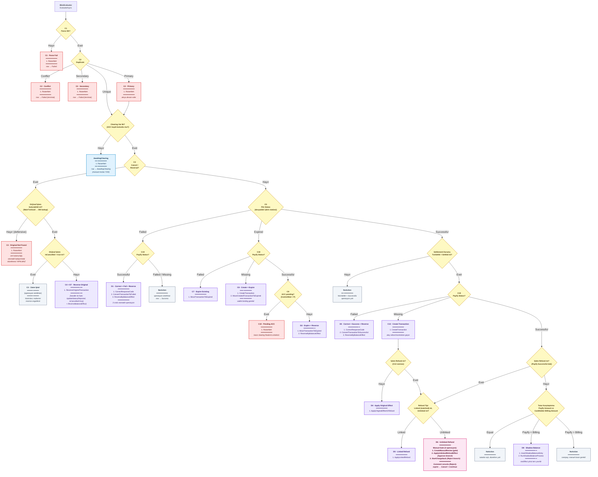

# LinkPara Card — Güncel Sistem Referansı

**Son doğrulama tarihi:** 21 Nisan 2026  
**Kaynaklar:** `LinkPara.Card.API`, `LinkPara.Card.Application`, `LinkPara.Card.Infrastructure`, `LinkPara.Card.Domain`, `LinkPara.Card.Infrastructure/Persistence/SqlMigrations/PostgreSql/V1_0_4__ReportingViews.sql`, mevcut controller / service / validator / DTO / enum tanımları

> Bu belge yalnızca kaynak kod ve repository içindeki SQL/dokümantasyon dosyalarından doğrulanan davranışları anlatır. Kodda görünmeyen veya daha alt sistemde saklı olan davranışlar için özellikle belirtilmiştir.

---

## Sistem Genel Bakış

Bu repository içinde dokümantasyon açısından ana operasyon hattı dört parçadan oluşur:

1. **File Ingestion** — kart veya clearing dosyaları alınır, parse edilir, satır bazında kalıcılaştırılır, duplicate/correlation bilgileri üretilir, arşiv kopyası oluşturulur.
2. **Reconciliation** — ingestion satırları değerlendirilir, operasyon planları üretilir, gerekiyorsa manuel review açılır, sonra operasyonlar lease/retry mantığıyla yürütülür.
3. **Archive** — tamamlanmış canlı veri arşiv şemasına taşınır; taşınmadan önce uygunluk kontrol edilir, taşındıktan sonra sayı doğrulaması yapılır.
4. **Reporting** — canlı ve arşiv verilerinden üretilen salt-okunur rapor view’ları üzerinden operasyonel ve finansal görünürlük sağlanır.

Bu hattın güncel kod gerçekliği açısından en kritik noktaları şunlardır:

- `FileIngestion` ve `Reconciliation` akışı **BKM için ayrıntılı kural içeriğine sahiptir**.
- `VisaEvaluator` ve `MscEvaluator` kodda mevcut olsa da şu anda yalnızca **"rules not defined"** notu döndürür; BKM dışı reconciliation business kural seti bu kod tabanında tanımlı değildir.
- `Archive` modülü **yalnızca `Preview` ve `Run`** sunar. Geri taşıma (`restore`) akışı bu kodda yoktur.
- `Reporting` katmanı **tamamen view tabanlıdır**, yazma yapmaz, canlı (`LIVE`) ve arşiv (`ARCHIVE`) perspektiflerini aynı sözleşme altında sunar.
- `ReportingPolicies.Read` ayrı bir reporting yetkisi değildir; fiilen **`Reconciliation:ReadAll`** değerini kullanır.
- Dinamik raporlama endpoint’i generic görünse de serbest SQL yürütme sunmaz; yalnızca `reporting.rep_*` view’larının sözleşme kataloğunu okuyup izinli filtrelerle sorgu üretir.

### Sistem genel akış / kural akışı

Akış, tek büyük diyagrama sıkıştırıldığında A4 sayfasına okunabilir şekilde sığmıyor. Bu yüzden aynı süreç **iki katmanlı** sunulur:

1. **Şekil 1 — Sistem Akışı:** uçtan uca ana hat (ingestion → evaluate → manual review → execute → alert → archive → reporting).
2. **Şekil 2 — BKM Karar Ağacı:** evaluate içindeki C1–C19 / D1–D8 kural dallarının detayı.

Her iki diyagram da tek bir A4 sayfasına rahat sığacak şekilde kompakt tutulmuştur. Düğüm üzerindeki `(N)` etiketleri diyagramın altındaki **süreç notlarına** referanstır.

#### Şekil 1 — Sistem Akışı (uçtan uca)

```mermaid
%%{init: {
  "theme":"base",
  "themeVariables":{
    "fontSize":"10px",
    "fontFamily":"Inter, Segoe UI, Arial, sans-serif",
    "primaryColor":"#ffffff",
    "primaryBorderColor":"#334155",
    "primaryTextColor":"#0f172a",
    "lineColor":"#64748b",
    "edgeLabelBackground":"#f8fafc"
  },
  "flowchart":{
    "nodeSpacing":40,
    "rankSpacing":55,
    "padding":8,
    "useMaxWidth":true,
    "htmlLabels":true,
    "curve":"linear",
    "wrappingWidth":240
  }
}} }%%
flowchart LR

    %% =========================
    %% MAIN FLOW
    %% =========================
    SRC["Dosya kaynağı<br/>(Local / Remote)"] --> ING["<b>File Ingestion</b><br/>POST /v1/FileIngestion<br/>POST /v1/FileIngestion/{src}/{type}/{ct}<br/>Policy: FileIngestion:Create<br/><i>(1)</i>"]
    ING --> ORCH["Parse + FileKey (SHA256)<br/>+ Duplicate + Archive copy<br/><i>(2)</i>"]
    ORCH --> CLR{"Clearing dosya<br/>+ Success ?"}
    RDY["Ready satırlar"] --> EV["<b>Evaluate</b><br/>POST /v1/Reconciliation/Evaluate<br/>Policy: Reconciliation:Create<br/><i>(3)</i>"]
    EV --> EVS["EvaluateService<br/>Claim + Evaluator çalıştır"]
    EVS --> PER{"Sonuç"}
    OPS["Operations + Reviews persist<br/>Row = Success"] --> MR{"Manual review<br/>üretildi mi?<br/>(D6: unlinked refund)"}
    RV["<b>Approve / Reject</b><br/>POST /v1/Reconciliation/Reviews/Approve<br/>POST /v1/Reconciliation/Reviews/Reject<br/>Policy: Reconciliation:Update<br/><i>(4)</i>"] --> EX["<b>Execute</b><br/>POST /v1/Reconciliation/Operations/Execute<br/>Policy: Reconciliation:Create<br/><i>(5)</i>"]
    EX --> RUN["ExecuteService<br/>Lease + Idempotency<br/>+ Retry / Backoff<br/><i>(6)</i>"]
    RUN --> RST{"Sonuç"}
    REP["Reporting views<br/>LIVE + ARCHIVE"] --> RFIN["<b>Reporting endpoints</b><br/>Financial (12) + Operational (11)<br/>Documentation + Dynamic<br/>Policy: Reconciliation:ReadAll<br/><i>(8)</i>"]

    %% =========================
    %% CLEARING BRANCH
    %% =========================
    CLR -- "Evet" --> RQS["Requeue service<br/>AwaitingClearing → Ready"]
    CLR -- "Hayır" --> RDY
    RQS --> RDY

    %% =========================
    %% EVALUATE RESULT BRANCHES
    %% =========================
    PER -- "Success" --> OPS
    PER -- "AwaitingClearing" --> AWC["Row = AwaitingClearing"]
    PER -- "Failed" --> FAIL["Row = Failed<br/>+ Alert (Pending)"]

    AWC -. "clearing gelince" .-> RQS

    %% =========================
    %% MANUAL REVIEW BRANCH
    %% =========================
    MR -- "Evet" --> PND["<b>Pending Reviews</b><br/>GET /v1/Reconciliation/Reviews/Pending<br/>Policy: Reconciliation:ReadAll"]
    PND --> RV
    MR -- "Hayır" --> EX

    %% =========================
    %% EXECUTION RESULT BRANCHES
    %% =========================
    RST -- "Completed / Skipped" --> ADISP["AlertService.ExecuteAsync<br/>(pending alert dispatch)<br/>email gönderimi"]
    RST -- "Completed / Skipped" --> ARC{"Archive?<br/>(manuel veya<br/>AutoArchiveAfterExecute)"}
    RST -- "Failed" --> FAIL
    RST -- "Completed" --> REP

    %% =========================
    %% ARCHIVE BRANCH
    %% =========================
    ARC -- "Preview" --> APRV["<b>Archive Preview</b><br/>POST /v1/Archive/Preview<br/>Policy: Reconciliation:ReadAll"]
    ARC -- "Run" --> ARUN["<b>Archive Run</b><br/>POST /v1/Archive/Run<br/>Policy: Reconciliation:Delete<br/>Copy → Verify → Delete<br/><i>(7)</i>"]
    APRV --> REP
    ARUN --> REP

    %% =========================
    %% ALERT BRANCH
    %% =========================
    FAIL --> ADISP
    ADISP --> ALR["<b>Alerts (listeleme)</b><br/>GET /v1/Reconciliation/Alerts<br/>Policy: Reconciliation:ReadAll"]

    classDef default font-size:13px,stroke-width:1.1px;
    classDef policy fill:#dbeafe,stroke:#2563eb,stroke-width:1.4px,color:#0b2545,font-weight:bold;
    classDef decide fill:#fef9c3,stroke:#ca8a04,stroke-width:1.4px,color:#3f2d00,font-weight:bold;
    classDef danger fill:#fee2e2,stroke:#dc2626,stroke-width:1.4px,color:#5f0f0f,font-weight:bold;
    classDef ok fill:#dcfce7,stroke:#16a34a,stroke-width:1.4px,color:#0f3b1f,font-weight:bold;
    classDef awaiting fill:#e0f2fe,stroke:#0284c7,stroke-width:1.4px,color:#0b2d4b,font-weight:bold;
    classDef alert fill:#ffedd5,stroke:#ea580c,stroke-width:1.4px,color:#7c2d12,font-weight:bold;

    class ING,EV,RV,EX,APRV,ARUN,RFIN,ALR,PND policy;
    class CLR,PER,MR,RST,ARC decide;
    class FAIL danger;
    class OPS,REP ok;
    class AWC,RQS awaiting;
    class ADISP alert;
```

#### Şekil 2 — BKM Karar Ağacı (evaluate içi detay)

> Her terminal düğümde evaluator tarafından **üretilen tüm `OperationCode`'lar sıralı olarak** gösterilmiştir. Operasyonlar `ReconciliationOperation` tablosuna sırasıyla (sequence number) yazılır; ilki `Planned`, diğerleri `Blocked` başlar ve Execute aşamasında tek tek çalıştırılır. Manual gate (D6) üç operasyon üretir: gate + approve branch + reject branch.

**Karar düğümü kısaltma sözlüğü (mermaid node ID'leri):**

| Düğüm ID | Anlamı | Karşılığı / Kontrol Ettiği |
|---|---|---|
| `S` | Start | `BkmEvaluator.EvaluateAsync` giriş noktası |
| `C1` | Check 1 — Parse | Satır parse edilebildi mi? |
| `C2` | Check 2 — Duplicate | `DuplicateStatus`: `Unique / Primary / Secondary / Conflict` |
| `AW` | Awaiting Clearing decision | İlgili clearing satırı (ACC kaydı) bulundu mu? |
| `C3` | Check 3 — Cancel/Reversal | İşlem cancel/reversal tipinde mi? (`TxnStat in {Reverse, Void}`) |
| `OR` | Original Resolved | Cancel/reversal'in referans verdiği orijinal işlem DB'de bulunabildi mi? (defansif kontrol) |
| `OC` | Original Cancelled | Orijinal işlemde `IsCancelled == true` mu? |
| `FS` (= C5) | File Status | Dosyadaki işlemin file-tarafı statüsü: `Successful / Failed / Expired` |
| `PS1`, `PS2`, `PS3` (= C19) | Payify Status | Payify (Emoney) tarafındaki işlem statüsü: `Successful / Failed / Missing` |
| `C9` | ACC Pending | Clearing `ControlStat == "P"` (Problem/Pending) mı? |
| `SL` | Settlement | `TxnSettle == Settled` mi? (NonSettle olanlar erken NoAction'a düşer) |
| `RFS` | Refund Successful path | Payify Successful dalında işlem refund mu? |
| `RFQ` | Refund Question (C13 sonrası) | C13 (CreateTransaction) sonrası işlem refund mu? |
| `RF` | Refund Type | Refund linked (matched: `OceanMainTxnGuid` doğru) mı, unlinked mi? |
| `AMT` | Amount Comparison | Payify amount vs `CardHolderBillingAmount` (`Equal / <  / >`) |
| `OP_*` | Operation terminal | Operasyon üreten / üretmeyen terminal düğümler (kod prefix'i karar adıyla eşleşir) |

> **Not:** `Cn` kısaltmaları **kontrol/karar (Check)**, `Dn` kısaltmaları ise **karar+aksiyon (Decision with operations)** anlamındadır. `Dn` düğümleri her zaman bir veya daha fazla `OperationCode` üretirken `Cn` düğümleri ya saf koşul kontrolüdür (`C1/C2/C3/C5/C9/C19`) ya da yalnız `RaiseAlert` üretir (`C1/C2/C3/C10`) ya da otomatik tek-iki operasyonluk basit aksiyondur (`C7/C8/C13`).

**Operasyon üretim tablosu (karar noktası → üretilen tüm `OperationCode`'lar):**

| Karar | Koşul | Üretilen Operasyonlar (sıralı) | Row Son Status |
|---|---|---|---|
| **C1** | Parse başarısız | `RaiseAlert` | `Failed` |
| **C2 · Conflict** | Duplicate conflict | `RaiseAlert` | `Failed` (terminal) |
| **C2 · Secondary** | Duplicate secondary | `RaiseAlert` | `Failed` (terminal) |
| **C2 · Primary** | Duplicate primary (ilk satır) | `RaiseAlert` | devam eder |
| **AwaitingClearing** | Clearing detayı (ACC) yok | `RaiseAlert` | `AwaitingClearing` (manual review **yok**) |
| **C3 · Original Not Found** | Cancel/Reversal + referans verilen orijinal işlem DB'de yok | `RaiseAlert` | `Success` (defansif; otomatik bakiye/statü düzeltmesi YAPILMAZ) |
| **C3 · Already Cancelled** | Cancel/Reversal + orijinal `IsCancelled=true` | *(operasyon üretilmez)* | `Success` (NoAction; mükerrer reverse engellenir) |
| **C4 + D7** | Cancel/Reversal + orijinal canlı (IsCancelled=false) | `ReverseOriginalTransaction` | `Success` |
| **D1** | File `Failed` + Payify `Successful` | `CorrectResponseCode` → `ConvertTransactionToFailed` → `ReverseByBalanceEffect` | `Success` |
| **NoAction (Failed/Missing)** | File `Failed` + Payify `Failed`/`Missing` | *(operasyon üretilmez)* | `Success` |
| **C7** | File `Expired` + Payify `Failed` | `MoveTransactionToExpired` | `Success` |
| **C8** | File `Expired` + Payify `Missing` | `CreateTransaction` → `MoveCreatedTransactionToExpired` | `Success` |
| **C10** | File `Expired` + Payify `Successful` + ACC pending | `RaiseAlert` | `Success` (karar clearing'e ertelenir) |
| **D2** | File `Expired` + Payify `Successful` + ACC non-pending | `MoveTransactionToExpired` → `ReverseByBalanceEffect` | `Success` |
| **NoAction (NonSettle)** | File `Successful` + `TxnSettle=N` | *(operasyon üretilmez)* | `Success` |
| **D3** | File `Successful` + Settled + Payify `Failed` | `CorrectResponseCode` → `ConvertTransactionToSuccessful` → `ReverseByBalanceEffect` | `Success` |
| **C13** | File `Successful` + Settled + Payify `Missing` | `CreateTransaction` *(+ sonra refund dalı)* | akış devam eder |
| **D4** | C13 sonrası refund **değil** | `ApplyOriginalEffectOrRefund` | `Success` |
| **D5** | Refund + `Linked` (matched) | `ApplyLinkedRefund` | `Success` |
| **D6** | Refund + `Unlinked` | `CreateManualReview` *(gate)* → `ApplyUnlinkedRefundEffect` *(Approve)* → `StartChargeback` *(Reject)* | `Success` (karar manuel) |
| **NoAction (Equal)** | Payify `Successful` + Amount = Billing | *(operasyon üretilmez)* | `Success` |
| **D8** | Payify `Successful` + Payify **<** Billing | `InsertShadowBalanceEntry` → `RunShadowBalanceProcess` | `Success` |
| **NoAction (Overpay)** | Payify `Successful` + Payify **>** Billing | *(operasyon üretilmez)* | `Success` |

**Kritik operasyon-üretim kuralları:**

- **Manual gate (D6) yalnız tek yerde açılır**: unlinked refund dalında. `result.AddManualOperation(...)` çağrısı **tek seferde 3 operasyon** yazar: gate (`IsManual=true, Branch=Default`), approve branch (`Branch=Approve`), reject branch (`Branch=Reject`). Gate tamamlanana kadar branch'ler `Blocked`'tur; Execute katmanı karar uygulandığında biri `Blocked`'e alınıp çalışır, diğeri `Cancelled` olur.
- **Şadow balance (D8) sıralı iki operasyondur**: `InsertShadowBalanceEntry` önce, `RunShadowBalanceProcess` sonra. İkisi de `txnEffect` yönünü ters çevirir (`Debit→Credit`, `Credit→Debit`, default `Credit`).
- **`RaiseAlert` idempotent**: aynı `OperationId + AlertType + Message` üçlüsü tekrar denendiğinde duplicate alert üretilmez (`SKIPPED_ALREADY_APPLIED`).
- **`ReverseOriginalTransaction` tek operasyon ama iki fazlı handler**: `UpdateTransactionStatus(Rejected, isCancelled=true)` → `ReverseBalanceEffect`. Suffix'li idempotency key'ler (`:cancel`, `:reverse`) türetilir.
- **`CreateTransaction` ve `StartChargeback` wallet binding ister**: yoksa `Failed("WALLET_BINDING_MISSING")` / `Failed("CHARGEBACK_CONTEXT_INVALID")`. Chargeback ayrıca iki fazlı (`InitChargeback` → `ApproveChargeback`) ve init sonrası approve fail olursa **otomatik rollback yoktur**.
- **NoAction dalları evaluation kaydı yaratır ama operasyon yaratmaz** (`OperationCount=0`); `row.ReconciliationStatus=Success`, `row.Message` note'a eşlenir.
- **AwaitingClearing dalı terminal değildir**: `MarkAwaitingClearing(decisionPoint)` row'u `AwaitingClearing`'e alır, yalnız `RaiseAlert` üretir. Clearing dosyası `Success` ingestion edildiğinde `ClearingArrivalRequeueService` aynı correlation'a sahip satırları `Ready`'ye çevirir ve evaluate yeniden çalışır — yani **aynı dosya satırı BKM ağacına bir kez daha girer**.

**Renk rehberi (Şekil 2):**

| Renk | Anlam |
|---|---|
| 🟨 Sarı | Karar noktası (C1–C19, OC/RF/RFS/RFQ/AMT/SL/AW) |
| 🟪 Mor | Otomatik operasyon üreten terminal (D1–D8, C7/C8/C10/C13) |
| 🟥 Açık kırmızı | Sadece `RaiseAlert` üreten dallar (C1/C2/C3/C10) |
| 🩷 Pembe | **Manual gate dalı (D6)** — üç operasyonlu, tek terminal |
| 🟦 Açık mavi | `AwaitingClearing` dalı — clearing gelince tekrar evaluate edilir |
| ⚪ Gri | `NoAction` — operasyon üretilmez, row direkt `Success` |

**Renk rehberi:**

| Renk | Anlam |
|---|---|
| 🟦 Mavi | Endpoint + policy kapısı (`FileIngestion:Create`, `Reconciliation:*`, vb.) |
| 🟨 Sarı | Karar noktası (BKM C1–C19, IdempotencyKey, RetryCount, AutoArchive, …) |
| 🟥 Kırmızı | Terminal hata / reddedilen dal (`Failed`, `Exception`, `Alert + Stop`) |
| 🟩 Yeşil | Terminal başarı (`Completed`, `Success`, `Consumed`) |
| 🟦 Açık mavi | `AwaitingClearing` dalı; clearing dosyası gelince noktalı okla `Ready`'ye döner |

**Süreç notları:**

1. **Ingestion endpoint & profil:** `POST /v1/FileIngestion` ve route-tabanlı ikizi, `FileIngestion:Create` policy'si ile korunur. `profileKey = FileType + FileContentType` ile her format için ayrı parser/validator seti seçilir.
2. **Parse + FileKey + Duplicate + Archive copy:** Satırlar byte offset ile parse edilip typed detail tablolarına yazılır. Dosya kimliği yalnız isimden değil, header + footer typed property'lerinden **SHA256** ile deterministik üretilir — aynı mantıksal dosya farklı isimle gelse bile duplicate olarak tanınır ve recovery bu anahtar üzerinden yürür. Duplicate satırlar `Primary/Secondary/Conflict` olarak işaretlenir; `Secondary` ve `Conflict` satırlar `ReconciliationStatus = Failed` yapılır. Arşiv kopyası ingestion ile paralel yazılır.
3. **Evaluate:** `POST /v1/Reconciliation/Evaluate` (`Reconciliation:Create`). `Ready` satırlar `Serializable` izolasyonla chunk halinde claim edilir ve `EVAL_CLAIM:{runId}` marker'ı ile işaretlenir. Stale claim'ler `ClaimTimeoutSeconds` (default 1800 sn) sonrası devralınabilir. **Kod default `ChunkSize = 50_000`, fakat request override üst sınırı `10_000`'dir.** Context, `CorrelationKey:CorrelationValue` grubu + Payify (Emoney) işlem geçmişi ile kurulur. Batch insert başarısız olursa kod otomatik **per-item fallback**'e düşer; tek bozuk satır chunk'ı batırmaz.
4. **Manual review:** `POST /v1/Reconciliation/Reviews/Approve|Reject` (`Reconciliation:Update`). Yalnız BKM kural ağacındaki **D6 (unlinked refund)** dalında otomatik üretilir. Tek `AddManualOperation` çağrısı; gate + approve branch + reject branch olmak üzere **üç operasyon** oluşturur. `Approve` dalı `ApplyUnlinkedRefundEffect`, `Reject` dalı `StartChargeback` çalıştırır. Default timeout 1 gün, expiration action `Cancel`, flow action `Continue`. `Reject` için `Comment` zorunlu, `Approve` için opsiyoneldir.
5. **Execute:** `POST /v1/Reconciliation/Operations/Execute` (`Reconciliation:Create`). Seçim önceliği **`OperationIds > EvaluationIds > GroupIds > All`**. `GetNextOperation` yalnız (a) `NextAttemptAt <= now`, (b) lease boş/expired, (c) parent tamamlanmış operasyonları seçer. Branch operasyonları, manual gate kararı uygulanmadan açılmaz. `MaxEvaluations` kod default `500_000`, request override üst sınırı `100_000`'dir.
6. **Lease + Idempotency + Retry/Backoff:** `LeaseOwner` worker kimliğini, `LeaseExpiresAt` maksimum yürütme süresini tanımlar (`LeaseSeconds` default 900 sn, override `1..3600`). Aynı `IdempotencyKey` başka bir `Completed` operasyonda varsa mevcut operasyon `Skipped` işaretlenir — **önemli:** `Skipped` sonuçlar response'ta `TotalSucceeded` içinde sayılır, saf başarı metriği olarak okunmamalıdır. Başarısızlıkta `RetryCount += 1`; `>= MaxRetries` ise `Failed` + `OperationExecutionFailed` alert, aksi halde `NextAttemptAt = now + 30 * 2^RetryCount` sn (örn. 30s, 60s, 120s, 240s, …).
7. **Archive Run:** `POST /v1/Archive/Run` (`Reconciliation:Delete`). `RepeatableRead` izolasyonunda 13 aggregate tablo önce arşiv şemasına kopyalanır, satır sayıları verify edilir, ardından canlı taraftan bağımlılık sırasına göre silinir, en son live tarafın boşaldığı tekrar verify edilir. Herhangi bir adım başarısız olursa transaction rollback olur ve `failure_reason` kolonu ilgili step kodunu (`ARCHIVE_COPY`, `LIVE_DELETE`, …) taşır. `POST /v1/Archive/Preview` (`Reconciliation:ReadAll`) yalnızca eligibility hesaplar, veri değiştirmez.
8. **Reporting:** Tüm `v1/Reporting/*` endpoint'leri `ReportingPolicies.Read` (= `Reconciliation:ReadAll`) ile korunur. Finansal/operasyonel view'lar `LIVE + ARCHIVE` perspektifinde okunur. Dynamic endpoint generic bir SQL yürütücü **değildir**: `ReportName` boşsa rapor kataloğu + contract'lar döner, dolu `ReportName` için yalnız `reporting.rep_*` view'ları üzerinde contract'ta tanımlı kolonlarla filtre üretilir. Parametreler prepared statement ile geçilir; SQL injection yüzeyi yoktur. Sonuç kümesi `SafetyRowLimit = 10_000` ile sert sınırlanır.

> **AwaitingClearing nüansı:** BKM evaluator, clearing detayı (ACC kaydı) yoksa karar vermek yerine satırı `AwaitingClearing`'e taşır ve yalnızca **tek bir bilgilendirme alert'i** üretir; manuel review açılmaz. Clearing dosyası `Success` olarak ingestion edildiğinde `ClearingArrivalRequeueService` aynı correlation'a sahip satırları `Ready`'ye çeker ve evaluate yeniden koşar. Bu yüzden `AwaitingClearing`, terminal hata olarak yorumlanmamalıdır.

**Ek operasyonel notlar (diyagrama yansıyan ama tek düğümde gözükmeyen):**

- `ReportingPolicies.Read` ayrı bir policy değildir; fiilen `Reconciliation:ReadAll` değerine map'lenir.
- `Archive/Run` `Reconciliation:Delete` ister çünkü canlı aggregate'i siler; bu, archive için ayrı bir yetki ailesi **olmadığı** anlamına gelir.
- `FileIngestion` consumer'ı (`Card.FileIngestionAndReconciliation.SerialQueue`) **single-active-consumer** modunda çalışır; paralel ingestion scoped orchestrator ile dosya düzeyinde sağlanır.
- `EvaluationResult` `AwaitingClearing` işaretliyse root row `Success` **yapılmaz**; yalnızca `AwaitingClearing` yazılır, böylece metrikler yanlış yorumlanmaz.
- `Reject` endpoint'inde `Comment` **zorunludur**; `Approve`'da opsiyoneldir. Her iki operasyon da review yalnız `Pending` ise etkilidir, operation ise yalnız `Blocked` / `Planned` ise branch requeue edilir.

---

## Modül Bazlı Mimari

### Katmanlar

| Katman | Sorumluluk | Bu belge için kritik parçalar |
|---|---|---|
| API | Route, HTTP sözleşmesi, authorization | `FileIngestionController`, `ReconciliationController`, `ArchiveController`, `ReportingController` |
| Application | MediatR command/query, validator, request/response contract | `*Command.cs`, `*Query.cs`, validator dosyaları, contract DTO’ları |
| Infrastructure | Gerçek iş akışı ve yan etkiler | `FileIngestionOrchestrator`, `EvaluateService`, `ExecuteService`, `ReviewService`, `AlertService`, `ArchiveService`, `ReportingService` |
| Domain | Enum’lar ve persistence entity tipleri | ingestion / reconciliation / reporting enum dosyaları |
| Persistence | EF mapping, schema/view bağları, SQL view anlamı | `CardDbContext`, reporting configuration’ları, `V1_0_4__ReportingViews.sql` |

### Çekirdek servisler

| Alan | Sınıf | Ana rol |
|---|---|---|
| File ingestion | `FileIngestionOrchestrator` | Dosya çözümleme, parse, batch persist, recovery, duplicate/match finalize |
| Reconciliation evaluate | `EvaluateService` | `Ready` satırları claim etme, evaluator çağırma, evaluation/operation/review persist etme |
| Reconciliation execute | `ExecuteService` | Operasyon seçme, lease alma, retry/backoff, manual gate çözme |
| Manual review | `ReviewService` | Approve/reject kararını kalıcılaştırma, pending review listeleme |
| Alerts | `GetAlertsService`, `AlertService` | Alert listeleme ve bildirim gönderim hattı |
| Clearing requeue | `ClearingArrivalRequeueService` | Clearing dosyası gelince `AwaitingClearing` satırlarını `Ready` yapma |
| Archive | `ArchiveService`, `ArchiveExecutor`, `ArchiveAggregateReader`, `ArchiveEligibilityEvaluator`, `ArchiveVerifier` | Preview, eligibility, copy+verify+delete akışı |
| Reporting | `ReportingService`, `DynamicReportingService`, `DynamicReportingSqlBuilder` | View sorgulama, documentation, dynamic catalog/data dönüşü |

### Persistence şemaları

`CardDbContext` iki ana veri ailesi ve bir reporting katmanı kurar:

- `ingestion`
  - `file`
  - `file_line`
  - `card_visa_detail`, `card_msc_detail`, `card_bkm_detail`
  - `clearing_visa_detail`, `clearing_msc_detail`, `clearing_bkm_detail`
- `reconciliation`
  - `evaluation`
  - `operation`
  - `review`
  - `operation_execution`
  - `alert`
- `archive`
  - yukarıdaki ingestion + reconciliation aggregate’lerinin arşiv kopyaları
  - `archive_log`
- `reporting`
  - `rep_*` view’ları (PostgreSQL)
  - `Vw*` view’ları (MSSQL)

### Consumer / arka plan tetikleme yapısı

`FileIngestionAndReconciliationConsumer` üç job tipini destekler:

- `IngestFile`
- `Evaluate`
- `Execute`

Mesaj sözleşmesi `FileIngestionAndReconciliationJobRequest` içinde taşınır. Önemli nüanslar:

- `InitiatedByUserId` mesajdan gelmezse header’lardan türetilmeye çalışılır.
- `EvaluateRequest` ve `ExecuteRequest` null gelirse consumer yeni boş request üretir.
- `IngestionRequest` null gelirse ingest job doğrudan başarısız yanıt üretir.
- `RespondToContext` davranışı `Reconciliation.Consumer.RespondToContext` option’ına bağlıdır.

---

## Authorization / Policy Yapısı

### Policy sabitleri

| Sabit | Değer |
|---|---|
| `FileIngestionPolicies.Read` | `FileIngestion:Read` |
| `FileIngestionPolicies.ReadAll` | `FileIngestion:ReadAll` |
| `FileIngestionPolicies.Create` | `FileIngestion:Create` |
| `FileIngestionPolicies.Update` | `FileIngestion:Update` |
| `FileIngestionPolicies.Delete` | `FileIngestion:Delete` |
| `ReconciliationPolicies.Read` | `Reconciliation:Read` |
| `ReconciliationPolicies.ReadAll` | `Reconciliation:ReadAll` |
| `ReconciliationPolicies.Create` | `Reconciliation:Create` |
| `ReconciliationPolicies.Update` | `Reconciliation:Update` |
| `ReconciliationPolicies.Delete` | `Reconciliation:Delete` |
| `ReportingPolicies.Read` | `Reconciliation:ReadAll` |

### Controller bazında policy kullanımı

| Endpoint grubu | Policy |
|---|---|
| `POST /v1/FileIngestion*` | `FileIngestion:Create` |
| `POST /v1/Reconciliation/Evaluate` | `Reconciliation:Create` |
| `POST /v1/Reconciliation/Operations/Execute` | `Reconciliation:Create` |
| `POST /v1/Reconciliation/Reviews/Approve` | `Reconciliation:Update` |
| `POST /v1/Reconciliation/Reviews/Reject` | `Reconciliation:Update` |
| `GET /v1/Reconciliation/Reviews/Pending` | `Reconciliation:ReadAll` |
| `GET /v1/Reconciliation/Alerts` | `Reconciliation:ReadAll` |
| `POST /v1/Archive/Preview` | `Reconciliation:ReadAll` |
| `POST /v1/Archive/Run` | `Reconciliation:Delete` |
| Tüm `v1/Reporting/*` | `ReportingPolicies.Read` = `Reconciliation:ReadAll` |

### Operasyonel anlam

- **Read vs ReadAll** farkı controller yüzeyinde özellikle reconciliation listelerinde görünür; dokümante edilen okuma endpoint’leri doğrudan `ReadAll` ister.
- **Create** policy’si yalnız veri üretmek için değil, reconciliation’da **evaluate ve execute operasyonlarını başlatmak** için de kullanılır.
- **Delete** policy’si archive run’da kullanılır; bunun sebebi archive run’ın canlı aggregate’i silmesidir.
- Reporting için ayrı bir `Reporting:*` ailesi yoktur; okuma yetkisi reconciliation read-all ile aynı havuza bağlanmıştır.

---

## File Ingestion Süreci

### Amaç

File ingestion katmanı kart veya clearing dosyasını sisteme alır, satırları parse eder, typed detail tablolarına yazar, correlation ve duplicate işaretlerini üretir, aynı anda arşiv kopyasını oluşturmaya çalışır ve dosya final state’ini hesaplar.

### Endpoint’ler

#### 1) Body tabanlı ingestion

- **Route:** `POST /v1/FileIngestion`
- **Policy:** `FileIngestion:Create`
- **Request:** `FileIngestionRequest`
- **Handler:** `FileIngestionCommandHandler`
- **Servis:** `IFileIngestionService.IngestAsync` → `FileIngestionOrchestrator.IngestAsync`

| Alan | Tip | Anlamı | Validation / fallback |
|---|---|---|---|
| `FileSourceType` | `FileSourceType` | Dosya kaynağı (`Remote`, `Local`) | `IsInEnum()` |
| `FileType` | `FileType` | Dosya ailesi (`Card`, `Clearing`) | `IsInEnum()` |
| `FileContentType` | `FileContentType` | İçerik formatı (`Bkm`, `Msc`, `Visa`) | `IsInEnum()` |
| `FilePath` | `string` | Local ise açık dosya/dizin yolu | `Remote` için boş olmalı, `Local` için zorunlu |

**Null request davranışı:** controller null body geldiğinde `new FileIngestionRequest()` üretir; bu crash’i önler ama validator büyük olasılıkla isteği reddeder.

#### 2) Route tabanlı ingestion

- **Route:** `POST /v1/FileIngestion/{fileSourceType}/{fileType}/{fileContentType}`
- **Policy:** `FileIngestion:Create`
- **Body:** `FileIngestionRouteRequest`

**Body vs route farkı**

- `FileSourceType`, `FileType`, `FileContentType` body’den değil route’tan gelir.
- Body yalnız `FilePath` taşır.
- Route enum’ları geçerliyse ve `Remote` seçildiyse `FilePath` null olması validation hatası üretmez.
- Aynı route Local çağrıldıysa `FilePath` boş ise validation hatası oluşur.

### Ingestion adım adım çalışma akışı

1. Profil çözümleme: profile key = `{FileType}{FileContentType}`.
2. Local dosya/dizin veya remote listeden aday dosya çözümü.
3. Header/footer boundary read ve footer `TxnCount` kullanımı.
4. Header+footer property’lerinden SHA256 ile file key üretimi.
5. Aynı file key + file name + source type + file type ile duplicate/recovery kararı.
6. Yeni dosyada satırların byte offset ile okunması, parse edilmesi, typed detail’e çevrilmesi, batch persist edilmesi.
7. Recovery akışında `LastProcessedByteOffset` üzerinden kaldığı yerden devam edilmesi.
8. Finalize aşamasında duplicate kararları, card↔clearing match alanları ve dosya sayaçlarının güncellenmesi.

### Correlation üretimi

#### Birincil yol

Parsed detail modelde `OceanTxnGuid > 0` ise:

- `CorrelationKey = "OceanTxnGuid"`
- `CorrelationValue = OceanTxnGuid`
- `ReconciliationStatus = Ready`

#### Fallback yol

`OceanTxnGuid` yoksa composite key oluşturulur.

**Card için:** `Rrn`, `CardNo`, `ProvisionCode`, `Arn`, `Mcc`, `CardHolderBillingAmount`, `CardHolderBillingCurrency`  
**Clearing için:** `Rrn`, `CardNo`, `ProvisionCode`, `Arn`, `MccCode`, `SourceAmount`, `SourceCurrency`

Herhangi bir kritik parça yoksa row `ReconciliationStatus=Failed` yapılır.

### Duplicate davranışı

#### Card duplicate detection

- Duplicate detection key çoğu durumda correlation value’dur.
- Aynı key’e sahip card satırlarında eşdeğerlik ayrıca şu imza ile kontrol edilir:
  - `CardNo`
  - `Otc`
  - `Ots`
  - `CardHolderBillingAmount`

#### Clearing duplicate detection

- Duplicate detection key = `ClrNo:ControlStat`
- Aynı key’e sahip clearing satırlarında eşdeğerlik `ParsedContent` tam string eşitliğidir.

#### Sonuç statüleri

| Durum | Anlamı | Reconciliation etkisi |
|---|---|---|
| `Unique` | Tekil satır | normal akış |
| `Primary` | Eşdeğer duplicate grubunun işleme alınan ilk satırı | `ReconciliationStatus` korunur |
| `Secondary` | Eşdeğer duplicate grubunun geri kalan satırları | zorla `ReconciliationStatus=Failed` |
| `Conflict` | Aynı duplicate key altında içerik çelişkisi var | zorla `ReconciliationStatus=Failed` |

### Card ↔ clearing eşleştirme ve requeue

- Finalize aşamasında başarılı detail satırları için `MatchedClearingLineId` güncellenir.
- Clearing dosyası `Success` olursa `ClearingArrivalRequeueService` çağrılır.
- Bu servis `AwaitingClearing` olan card satırlarını tekrar `Ready` yapar.
- Bu requeue başarısız olsa bile dosya `Success` statüsü geri alınmaz.

### Response modeli

Her endpoint `List<FileIngestionResponse>` döndürür:

- `FileId`
- `FileKey`
- `FileName`
- `Status`
- `StatusName`
- `Message`
- `TotalCount`
- `SuccessCount`
- `ErrorCount`
- `Errors[]`

---

## Reconciliation Süreci

Reconciliation katmanı iki ana evreden oluşur:

1. **Evaluate** — satırları karar ağacına sokar ve operasyon planı üretir.
2. **Execute** — planlanan operasyonları uygular.

Arada iki yan hat vardır:

- **Manual Review** — manuel gate/branch akışı
- **Alerts / Pending Reviews** — operasyonel görünürlük ve müdahale yüzeyi

---

## Evaluate

### Endpoint kimliği

- **Route:** `POST /v1/Reconciliation/Evaluate`
- **Policy:** `Reconciliation:Create`
- **Request:** `EvaluateRequest`
- **Handler:** `EvaluateCommandHandler`
- **Servis:** `IReconciliationService.EvaluateAsync` → `ReconciliationService` → `EvaluateService`

### Request alanları

| Alan | Tip | Davranış |
|---|---|---|
| `IngestionFileIds` | `Guid[]` | Boşsa tüm uygun satırlar hedeflenir |
| `Options` | `EvaluateOptions?` | Null ise config default’ları kullanılır |

### EvaluateOptions

| Alan | Kod default’u | Request override aralığı |
|---|---:|---:|
| `ChunkSize` | `50_000` | `100 .. 10_000` |
| `ClaimTimeoutSeconds` | `1_800` | `30 .. 3600` |
| `ClaimRetryCount` | `5` | `1 .. 10` |
| `OperationMaxRetries` | `5` | `0 .. 50` |

**Kritik nüans:** Kod default `ChunkSize=50_000`, fakat request override validator üst sınırı `10_000`’dir.

### Evaluate response

| Alan | Anlamı |
|---|---|
| `EvaluationRunId` | Bu çalıştırmanın grup kimliği |
| `CreatedOperationsCount` | Oluşturulan operasyon sayısı |
| `SkippedCount` | Hata / atlama nedeniyle finalize edilemeyen satır sayısı |
| `Message`, `ErrorCount`, `Errors` | Base response alanları |

### Claim mekanizması

- Yalnız `ReconciliationStatus == Ready` satırlar hedeflenir.
- Claim edilen satırlar `Processing` statüsüne alınır.
- Stale processing satırlar timeout sonrası devralınabilir.
- Aynı satırın eşzamanlı iki kez evaluate edilmesini engellemek için claim kullanılır.

### Evaluator seçimi

| Content type | Evaluator | Kod gerçekliği |
|---|---|---|
| `Bkm` | `BkmEvaluator` | Ayrıntılı kural ağacı mevcut |
| `Visa` | `VisaEvaluator` | `RulesNotDefined` notu döndürür |
| `Msc` | `MscEvaluator` | `RulesNotDefined` notu döndürür |

### BkmEvaluator detaylı flow

Detaylı uçtan uca akış için bkz. üstteki tek diyagram: `Sistem genel akış / kural akışı`. BKM karar ağacı (C1–C19, D1–D8) o diyagramın `Reconciliation / BkmEvaluator` alt bloğunda tam olarak çizilmiştir.

### Evaluate sonucu ne üretir?

`EvaluationResult` şu parçaları taşıyabilir:

- `Note`
- `Operations[]`
- `IsAwaitingClearing`
- `DecisionPoint`

`EvaluationResult.AddManualOperation` tek çağrıda üç operasyon üretir:

1. gate operation (`IsManual=true`, branch `Default`)
2. approve branch operation (`Branch=Approve`)
3. reject branch operation (`Branch=Reject`)

Default review ayarları:

- timeout: 1 gün
- expiration action: `Cancel`
- expiration flow action: `Continue`

### Persist davranışı

Başarılı yol:

1. `ReconciliationEvaluation` kaydı oluşturulur.
2. `EvaluationOperation` listesi `ReconciliationOperation` kayıtlarına çevrilir.
3. Manuel gate varsa `ReconciliationReview` eklenir.
4. Root row `ReconciliationStatus=Success` yapılır.

Awaiting-clearing yolu:

- Evaluator `MarkAwaitingClearing(decisionPoint)` kullanırsa root row `Success` yapılmaz.
- Root row `ReconciliationStatus=AwaitingClearing` yapılır.
- Clearing dosyası gelince requeue ile tekrar `Ready` olur.

Hata yolu:

- Evaluation `Failed`
- Root row `ReconciliationStatus=Failed`
- `ReconciliationAlert` eklenir
- `SkippedCount` artar

### İşsel anlam

Evaluate saf yürütme yapmaz; yalnız karar verir ve plan üretir.

Bu yüzden:

- evaluate response’taki `CreatedOperationsCount` finansal hareket sayısı değildir,
- `Visa` ve `Msc` için evaluate çağrısı mevcut kodda BKM ile aynı karar derinliğini sağlamaz.

---

## Execute

### Endpoint kimliği

- **Route:** `POST /v1/Reconciliation/Operations/Execute`
- **Policy:** `Reconciliation:Create`
- **Request:** `ExecuteRequest`
- **Handler:** `ExecuteCommandHandler`
- **Servis:** `IReconciliationService.ExecuteAsync` → `ExecuteService`

### Request alanları

| Alan | Tip | İşlev |
|---|---|---|
| `GroupIds` | `Guid[]` | Evaluate run bazında filtre |
| `EvaluationIds` | `Guid[]` | Belirli evaluation’lar |
| `OperationIds` | `Guid[]` | En dar kapsam; belirli operasyonlar |
| `Options` | `ExecuteOptions?` | Lease ve evaluation limiti override |

### Seçim önceliği

1. `OperationIds`
2. `EvaluationIds`
3. `GroupIds`
4. hiçbiri yoksa **All**

### ExecuteOptions

| Alan | Kod default’u | Request override aralığı |
|---|---:|---:|
| `MaxEvaluations` | `500_000` | `1 .. 100_000` |
| `LeaseSeconds` | `900` | `1 .. 3600` |

### Execute response

| Alan | Anlamı |
|---|---|
| `TotalAttempted` | Denenen sonuç sayısı |
| `TotalSucceeded` | `Completed` + `Skipped` |
| `TotalFailed` | `Failed` |
| `Results` | `OperationExecutionResult[]` |
| Base fields | `Message`, `ErrorCount`, `Errors` |

**Kritik yorumlama notu:** `Skipped` sonuçlar `TotalSucceeded` içinde sayılır.

### Lease / retry / backoff

- `Executing` + lease geçerli operasyonlar tekrar alınmaz.
- `Executing` + lease expired operasyonlar reclaim edilebilir.
- Başarısızlıkta `RetryCount += 1` yapılır.
- `RetryCount >= MaxRetries` ise `OperationStatus=Failed` olur.
- Aksi halde `NextAttemptAt = now + 30 * 2^RetryCount sn` ile tekrar planlanır.

### Manual gate execute davranışı

`CreateManualReview` kodlu operasyonlar normal finansal işlem gibi yürütülmez.

| Durum | Sonuç |
|---|---|
| Review kaydı yok | operation failed |
| Review pending | operation blocked / execution skipped |
| Review expired | expiration action uygulanır |
| Review approved | approve branch açılır, reject branch cancel |
| Review rejected | reject branch açılır, approve branch cancel |
| Review cancelled | gate ve branch’ler cancel |

### Auto archive davranışı

`ArchiveOptions.AutoArchiveAfterExecute == true` ve `response.TotalSucceeded > 0` ise arka planda boş `ArchiveRunRequest` ile archive tetiklenir.

---

## Manual Review

### Approve

- **Route:** `POST /v1/Reconciliation/Reviews/Approve`
- **Policy:** `Reconciliation:Update`
- **Request:** `ApproveRequest`

| Alan | Davranış |
|---|---|
| `OperationId` | zorunlu, boş GUID olamaz |
| `ReviewerId` | null/empty ise audit context user GUID kullanılır |
| `Comment` | opsiyonel, max 2000 |

Muhtemel `Result` değerleri: `Approved`, `NotFound`, `Invalid`, `Failed`

### Reject

- **Route:** `POST /v1/Reconciliation/Reviews/Reject`
- **Policy:** `Reconciliation:Update`
- **Request:** `RejectRequest`

Kritik farklar:

- `Comment` zorunludur.
- review kararı `Rejected` yapılır.

Muhtemel `Result` değerleri: `Rejected`, `NotFound`, `Invalid`, `Failed`

### Pending Reviews

- **Route:** `GET /v1/Reconciliation/Reviews/Pending`
- **Policy:** `Reconciliation:ReadAll`
- **Query:** `GetPendingReviewsQuery`

Servis davranışı:

- yalnız `Decision == Pending` review’lar gelir,
- `Date` varsa `CreateDate` gün bazında filtrelenir,
- sonuç `CreateDate` artan sırada sayfalanır,
- approve/reject branch operasyonları response’a ayrı listeler halinde eklenir.

---

## Alerts

### Listeleme endpoint’i

- **Route:** `GET /v1/Reconciliation/Alerts`
- **Policy:** `Reconciliation:ReadAll`
- **Query:** `GetAlertsQuery`

Servis davranışı:

- `Date` varsa create-date günü filtrelenir,
- `AlertStatus` varsa enum bazlı filtre uygulanır,
- order `CreateDate desc`’dir,
- size `1..1000` aralığına clamp edilir.

### Alert lifecycle

1. `Pending` ve opsiyona göre `Failed` alert’ler alınır.
2. Her alert `Processing` yapılmaya çalışılır.
3. Gönderim başarılıysa `Consumed` olur.
4. Gönderim başarısızsa `Failed` olur.

---

## Archive Süreci

Archive modülü canlı aggregate’i arşiv şemasına taşır. İşlem iki ayrı endpoint’e bölünmüştür: `Preview` ve `Run`.

### Preview

- **Route:** `POST /v1/Archive/Preview`
- **Policy:** `Reconciliation:ReadAll`
- **Request:** `ArchivePreviewRequest`
- `UseConfiguredBeforeDateOnly=true` ise request `BeforeDate` yok sayılır.
- strategy desteği yalnız `None` ve `RetentionDays`.
- effective limit config default’tan gelir ve `1..10000` clamp edilir.

### Run

- **Route:** `POST /v1/Archive/Run`
- **Policy:** `Reconciliation:Delete`
- **Request:** `ArchiveRunRequest`
- 13 aggregate parçası kopyalanır, verify edilir, canlıdan silinir.
- `ContinueOnError=false` ise ilk failed item sonrası süreç durur.
- restore akışı bu repo’da yoktur.

### Preview / Run farkı

| Konu | Preview | Run |
|---|---|---|
| Veri değiştirir mi? | Hayır | Evet |
| Dry-run mı? | Evet | Hayır |
| Count snapshot | Evet | İçeride verification için kullanılır |
| Geri dönüş | Gerekmez | Kodda restore yoktur |

---

## Reporting Sistemi

### Genel Yapı

- Reporting katmanı **salt-okunur view** katmanıdır; yazma yapmaz.
- `CardDbContext` reporting DTO'larını **keyless entity** olarak `reporting.rep_*` (PostgreSQL) / `reporting.Vw*` (MSSQL) view'larına bağlar.
- Çoğu query `Page` / `Size` kullanır; `SortBy` / `OrderBy` metadata response'a taşınsa da **servis order'ı çoğu endpoint'te sabittir** (default `urgency ASC, age DESC` mantığı view tarafında uygulanır).
- `DataScope` ile **`LIVE`** (aktif aksiyon) ve **`ARCHIVE`** (tarihsel analiz) aynı DTO ailesinden okunur — kullanıcı tek endpoint üzerinden iki perspektifi sorgulayabilir.
- Tüm rapor satırlarında **`urgency`** ve **`recommended_action`** kolonları operasyonel önceliği ve net aksiyonu belirtir; raporlar yalnız metric değil, **karar destek** çıktısı verir.
- `ARCHIVE` perspektifi neredeyse her zaman `urgency = P4` döner (geçmiş kayıt aksiyon önceliği taşımaz).
- Runtime'da rapor sözleşmesi `GET /v1/Reporting/Documentation` ile sorgulanabilir; bu doküman aynı içeriğin statik özetidir.

### Ortak Şema ve Sözlük (tüm `rep_*` view'larında geçerli)

Aşağıdaki sözlük her raporda tekrar yazılmaz, ancak tüm view'larda geçerlidir.

| Alan | Değerler ve anlam |
|---|---|
| `data_scope` | `LIVE` (aktif aksiyon listesi) / `ARCHIVE` (tarihsel kayıt) |
| `urgency` | `P1` kritik (dakikalar içinde) / `P2` yüksek (saatler) / `P3` orta (vardiya içinde) / `P4` düşük (günlük; ARCHIVE genelde P4) / `P5` bilgi (sadece izleme) |
| `network` | `BKM` / `VISA` / `MSC` (Mastercard). MSSQL view'larında `Visa` / `Msc` / `Bkm` (PascalCase) |
| `side` / `file_type` | `Card` / `Clearing` |
| `content_type` | `Visa` / `Msc` / `Bkm` |
| `recommended_action` | İlgili rapora özel string enum; her satırda **net bir aksiyon** verir (`INSPECT_…`, `ESCALATE_…`, `MONITOR_…`, `HISTORICAL_…` vb.) |

#### Currency (ISO 4217 numerik)

| Kod | Ülke / Birim |
|----|----|
| `949` | TRY (Türk Lirası) |
| `840` | USD (US Dollar) |
| `978` | EUR (Euro) |
| `826` | GBP | `392` | JPY | `756` | CHF | `036` | AUD |
| `UNKNOWN` | Veri kalitesi sorunu — kaynak satırda currency boş |

#### Response Code (ISO 8583)

| Kod | Anlam | Kod | Anlam |
|----|----|----|----|
| `00` | Approved | `51` | Insufficient funds |
| `01` | Refer to issuer | `54` | Expired card |
| `05` | Do not honor | `57` / `58` | Transaction not permitted |
| `12` | Invalid transaction | `61` | Exceeds withdrawal limit |
| `14` | Invalid card | `65` | Exceeds activity limit |
| `41` | Lost card | `91` | Issuer unavailable |
| `43` | Stolen card | `96` | System error |
| `NONE` | Eksik veri | | |

#### MCC örnekleri (ISO 18245)

| MCC | Kategori | MCC | Kategori |
|----|----|----|----|
| `5411` | Grocery / Süpermarket | `5812` | Restaurant |
| `5999` | Misc Retail | `5541` | Service Stations |
| `4900` | Utilities | `6011` | ATM |

#### Dispute / Reason kodları (chargeback)

| Network | Örnek kodlar |
|----|----|
| Visa | `11.1`, `11.2`, `11.3` (authorization), `13.1`, `13.2` (consumer dispute) |
| Mastercard | `4837` (no cardholder authorization), `4853` (cardholder dispute), `4855` (non-receipt of merchandise), `4870` (chip liability shift) |
| BKM | Yerel kodlar (network kataloğuna bakılır) |
| `NONE` | Dispute yok |

#### Eşik kuralları (`thresholds`) — özet

| Kod | Açıklama |
|----|----|
| `PROCESSING_STUCK` | `file.update_date`/`create_date` üzerinden 3600 sn (1 saat) |
| `RECON_READY_OVERDUE` | `file_line.create_date` üzerinden 86400 sn (1 gün) |
| `STUCK` (evaluation) | `create_date` üzerinden 3600 sn |
| `HUNG` (execution) | `started_at` üzerinden 1800 sn (30 dk) |
| `PENDING_STUCK` (alert) | 1800 sn (30 dk) |
| `LONG_STUCK` | 14400 sn (4 saat) |
| `ARCHIVE_RUN_STUCK` | `archive_log.create_date` üzerinden 3600 sn |
| `ELIGIBLE_BACKLOG` (archive) | 7 gün arşivlenmemiş `Success` dosya |
| `OVERDUE` (review) | 24 saat | `EXPIRING_SOON` 4 saat |
| `MATERIAL_NET_FLOW` / `IMBALANCE` | `|amount|` ≥ 1.000.000 |
| `HIGH_VALUE` (unmatched) | satır bazında ≥ 100.000 |
| `CRITICAL_HIGH_VALUE` | ≥ 1.000.000 |
| `HIGH_LINE_FAILURE_RATE` | failed/processed ≥ %20 |
| `MATERIAL_DRIFT` (FX) | `|drift|` ≥ 100k |
| `HIGH_CONCENTRATION` (MCC) | network içi pay ≥ %30 |
| `HIGH_LONG_TERM_INSTALLMENT` | 13+ taksit payı ≥ %10 |
| `HIGH_LOYALTY_USAGE` | loyalty/amount ≥ %10 |

### Operational Reports (11 endpoint, prefix `GET /v1/Reporting/Operational/`)

Operasyonel raporlar canlı vardiyaya hizmet eder; her satır bir aksiyon kümesidir. Aksiyon önceliği `urgency` + `recommended_action` ile verilir.

#### 1. `ActionRadar` (`reporting.rep_action_radar`) — `OPERATIONAL_OVERVIEW`

- **Amaç:** Tüm kategorilerdeki açık aksiyonları öncelik (P1..P4) ve sıralı worklist olarak tek radarda gösterir; **vardiya kontrolünün giriş noktasıdır**.
- **İş sorusu:** *"Şu an hangi konuya, hangi sırayla, hangi öncelikle bakmalıyım?"*
- **Kullanım:** Vardiya başında, gün içi 60–120 dk'da bir, escalation öncesi. **Hedef:** Operasyon, takım liderleri, NOC.
- **Kritik kolonlar:** `category` (`FILES`/`FILE_LINES`/`EVALUATIONS`/`OPERATIONS`/`EXECUTIONS`/`REVIEWS`/`ALERTS`/`ARCHIVE_RUNS`), `issue_type`, `open_count`, `oldest_age_hours`, `urgency`, `recommended_action`.
- **`issue_type` değerleri:** `FAILED` / `PROCESSING_STUCK` / `INCOMPLETE_DELIVERY` / `DUPLICATE_CONFLICT` / `RECON_FAILED` / `RECON_READY_OVERDUE` / `STUCK` / `RETRIES_EXHAUSTED` / `BLOCKED` / `LEASE_EXPIRED` / `MANUAL_PLANNED` / `HUNG` / `EXPIRED` / `OVERDUE` / `DELIVERY_FAILED` / `PENDING_STUCK` / `*_HISTORICAL`.
- **`recommended_action` değerleri:** `INSPECT_FILE_AND_REPROCESS` / `CHECK_PROCESSOR_AND_REQUEUE` / `REPROCESS_MISSING_LINES` / `RESOLVE_DUPLICATE_CONFLICTS` / `INVESTIGATE_RECONCILIATION_FAILURES` / `TRIGGER_OVERDUE_EVALUATIONS` / `RESTART_OR_REEVALUATE` / `MANUAL_INTERVENTION_REQUIRED` / `UNBLOCK_OR_RESOLVE_DEPENDENCY` / `RECLAIM_LEASE` / `PERFORM_MANUAL_OPERATION` / `KILL_AND_RESTART_EXECUTION` / `APPLY_EXPIRATION_DEFAULT` / `ESCALATE_OVERDUE_REVIEW` / `RESEND_OR_FIX_CHANNEL` / `CHECK_NOTIFICATION_PIPELINE` / `HISTORICAL_REVIEW_ONLY`.
- **Aksiyon rehberi:** Önce **tüm `P1`** satırlarını kapat → sonra `oldest_age_hours desc` ile sırala ve `P2`/`P3`'ü temizle. Her satır için `recommended_action` sütununu uygula.
- **LIVE ↔ ARCHIVE:** LIVE = aktif aksiyon listesi. ARCHIVE = geçmiş iş yükü ve kategori dağılım trendi (`urgency=P4`).
- **Kaynak tablolar:** `ingestion.file`, `ingestion.file_line`, `reconciliation.evaluation`, `reconciliation.operation`, `reconciliation.operation_execution`, `reconciliation.review`, `reconciliation.alert`, `archive.archive_log` + ARCHIVE muadilleri.
- **Not:** Sayım bazlıdır; finansal etki için `UnmatchedFinancialExposure` ve `HighValueUnmatchedTransactions` ile birlikte okunmalıdır.

#### 2. `UnhealthyFiles` (`reporting.rep_unhealthy_files`) — `FILE_PROCESSING`

- **Amaç:** Dosya alım kanalındaki sağlıksız dosyaları (FAILED, STUCK, INCOMPLETE, HIGH_FAILURE_RATE, PARTIAL) sebep kategorisiyle listeler.
- **İş sorusu:** *"Hangi dosyalar düzgün işlenmedi, neden ve nasıl müdahale etmeliyim?"*
- **Kullanım:** Saatlik veya her ingestion penceresi sonrası. **Hedef:** Dosya işleme operasyonu, destek, kanal sahibi.
- **Kritik kolonlar:** `file_id`, `file_name`, `side`, `network`, `file_status` (FileStatus: `Pending`/`Processing`/`Success`/`Failed`), `expected_line_count`, `processed_line_count`, `failed_line_count`, `failure_rate_pct`, `age_hours`, `issue_category`, `urgency`, `recommended_action`, `file_message`.
- **`issue_category`:** `FILE_REJECTED` / `STUCK_PROCESSING` / `INCOMPLETE_DELIVERY` / `HIGH_LINE_FAILURE_RATE` / `PARTIAL_LINE_FAILURES` / `HEALTHY`.
- **`recommended_action`:** `INSPECT_FILE_AND_REPROCESS` / `CHECK_PROCESSOR_AND_REQUEUE` / `REPROCESS_MISSING_LINES` / `INVESTIGATE_BULK_FAILURE_PATTERN` / `REVIEW_INDIVIDUAL_FAILED_LINES` / `NONE`.
- **Eşikler:** `STUCK_PROCESSING` 3600 sn; `HIGH_LINE_FAILURE_RATE` failed/processed ≥ %20.
- **Yorumlama:** `failure_rate_pct > %20` yapısal sorun, `%0–%20` arası münferit hatalar.
- **Aksiyon sırası:** (1) `FILE_REJECTED`+`STUCK_PROCESSING` (P1) çöz → (2) `INCOMPLETE_DELIVERY` için upstream kanalla iletişim → (3) `HIGH_LINE_FAILURE_RATE` için parser/mapping incelemesi → (4) `PARTIAL_LINE_FAILURES` için failed line drilldown.
- **Not:** Tek dosya birden fazla kategoriye düşebilir; toplama yaparken `file_id distinct` alınmalıdır.
- **Kaynak:** `ingestion.file` + `archive.ingestion_file`.

#### 3. `StuckPipelineItems` (`reporting.rep_stuck_pipeline_items`) — `PIPELINE_HEALTH`

- **Amaç:** Pipeline aşamalarında (`FILE_LINE` / `EVALUATION` / `OPERATION` / `EXECUTION`) takılı kalmış kayıtları yaş + state ile gösterir; **SRE/operasyonun ilk teşhis kaynağıdır**.
- **İş sorusu:** *"Pipeline'da neler takıldı, en uzun ne kadardır bekliyor, hangi state'te?"*
- **Kullanım:** Sürekli izleme; alarm aldıktan sonra ilk açılacak rapor.
- **Kritik kolonlar:** `stage`, `item_id`, `related_id` (parent file/line/evaluation/operation), `started_at` (UTC), `stuck_minutes`, `lease_owner`, `lease_expires_at` (yalnız `OPERATION` aşamasında dolu), `stuck_state`, `urgency`, `recommended_action`.
- **`stuck_state`:** `LEASE_EXPIRED` / `LONG_STUCK` (>4 saat) / `STUCK`.
- **`recommended_action`:** `REQUEUE_FILE_LINE_FOR_PROCESSING` / `RESTART_OR_REEVALUATE` / `RECLAIM_LEASE_AND_RESCHEDULE` / `INSPECT_OPERATION_AND_RESCHEDULE` / `KILL_HUNG_EXECUTION_AND_RETRY` / `INVESTIGATE`.
- **Eşikler:** FILE_LINE/EVALUATION/OPERATION 3600 sn; EXECUTION 1800 sn; LONG_STUCK 14400 sn.
- **Yorumlama:** `LEASE_EXPIRED` ve `LONG_STUCK` kritik; `HUNG_EXECUTION` sonlandırma gerektirir. OPERATION satırlarında gerçek bekleme = `NOW() - lease_expires_at`.
- **Aksiyon:** `LEASE_EXPIRED` operasyonlarda lease serbest bırakılır + yeniden zamanlanır; `HUNG_EXECUTION` sonlandırılır; aynı stage'te toplu tıkanıklık altyapı alarmı olarak escalate edilir.
- **Kaynak:** `ingestion.file_line`, `reconciliation.evaluation`/`operation`/`operation_execution` + ARCHIVE muadilleri.

#### 4. `ReconFailureCategorization` (`reporting.rep_recon_failure_categorization`) — `RECONCILIATION`

- **Amaç:** Başarısız reconciliation operasyonlarını `operation_code` + `branch` bazında gruplar, `last_error` üzerinden olası kök nedeni etiketler.
- **İş sorusu:** *"Reconciliation neden başarısız oluyor, hangi tip hata baskın, nereyi onarmalıyım?"*
- **Kullanım:** Günlük; ayrıca hata sıçramasında ad-hoc.
- **Kritik kolonlar:** `operation_code`, `branch`, `failed_count`, `retries_exhausted_count`, `manual_operation_count`, `oldest_failure_at`, `oldest_age_hours`, `likely_root_cause`, `urgency`, `recommended_action`.
- **`likely_root_cause`:** `TIMEOUT_OR_LATENCY` / `DUPLICATE_OR_CONFLICT` / `MISSING_DATA` / `AUTHORIZATION` / `CONNECTIVITY` / `VALIDATION` / `BUSINESS_RULE_FAILURE` / `UNCATEGORIZED` (heuristic ILIKE eşlemesi).
- **`recommended_action`:** `MANUAL_INTERVENTION_FOR_EXHAUSTED_RETRIES` / `INVESTIGATE_BULK_FAILURE_PATTERN` / `MONITOR_AUTO_RETRY_OUTCOME` / `HISTORICAL_TREND_ANALYSIS_ONLY`.
- **Eşikler:** `failed_count > 50 → P2`; `retries_exhausted_count > 0 → P1`.
- **Aksiyon:** Önce `retries_exhausted` satırlarını **manuel** çöz; sonra root cause'a göre dağıt: TIMEOUT/CONNECTIVITY → SRE; MISSING_DATA/VALIDATION → upstream; BUSINESS_RULE_FAILURE → kural sahibi.
- **Not:** Yeni bir hata kategorisi çıkarsa runbook güncellenmelidir.
- **Kaynak:** `reconciliation.operation` + ARCHIVE.

#### 5. `ManualReviewPressure` (`reporting.rep_manual_review_pressure`) — `MANUAL_REVIEW`

- **Amaç:** Manuel review kuyruğunda biriken kararların SLA baskısı + askıdaki finansal hacim.
- **İş sorusu:** *"Hangi review kararları SLA'yı aştı veya aşacak, ne kadar para askıda?"*
- **Kullanım:** Vardiya başı, öğle kontrolü, vardiya sonu. **Hedef:** Backoffice review ekibi + ekip lideri.
- **Kritik kolonlar:** `sla_bucket`, `default_on_expiry` (`ReviewExpirationAction` enum), `currency`, `pending_review_count`, `oldest_waiting_hours`, `exposure_amount`, `urgency`, `recommended_action`.
- **`sla_bucket`:** `EXPIRED` / `EXPIRING_SOON` (4 saat içinde) / `OVERDUE` (>24 saat) / `NORMAL`.
- **`default_on_expiry` (Documentation report değerleri):** `None` / `AutoApprove` / `AutoReject` / `EscalateToSupervisor` / `ApplyDefaultPolicy`. *(Not: koddaki `ReviewExpirationAction` enum bu README'nin diğer bölümlerinde `Cancel` / `Approve` / `Reject` olarak listelenir; runtime documentation farklı isimlendirme kullanıyor.)*
- **`recommended_action`:** `APPLY_DEFAULT_OR_DECIDE_NOW` / `DECIDE_BEFORE_EXPIRY` / `ESCALATE_OVERDUE_REVIEWS` / `WORK_THE_QUEUE` / `HISTORICAL_REFERENCE_ONLY`.
- **Eşikler:** `OVERDUE` 24 saat; `EXPIRING_SOON` `NOW + 4` saat.
- **Yorumlama:** `EXPIRED` + `EXPIRING_SOON` acildir; `exposure_amount` karar gecikmesinin parasal etkisidir; **currency bazında ayrılır**, toplama yaparken bu sınır kontrol edilmelidir.
- **Aksiyon:** `EXPIRED` grubuna runbook'taki default action veya derhal karar; `OVERDUE` sıraya alınır; `NORMAL` izlemede tutulur.
- **Kaynak:** `reconciliation.review` + ARCHIVE + 6 detail tablo (card_visa/msc/bkm, clearing_visa/msc/bkm) tutar için LATERAL JOIN.

#### 6. `AlertDeliveryHealth` (`reporting.rep_alert_delivery_health`) — `ALERTS`

- **Amaç:** Bildirim altyapısının teslim sağlığını `alert_type` + `severity` bazında ölçer; iletisi ulaşmayan kanalları ortaya çıkarır.
- **İş sorusu:** *"Bildirim altyapımız sağlıklı mı, hangi kanal/tip bozuk?"*
- **Kullanım:** Sürekli izleme; CRITICAL dakika içinde ele alınmalıdır.
- **Kritik kolonlar:** `severity` (`AlertSeverity` enum), `alert_type` (`AlertType` enum), `total_count`, `pending_count`, `failed_count`, `sent_count`, `failure_rate_pct`, `oldest_open_age_hours`, `delivery_health_status`, `urgency`, `recommended_action`.
- **`AlertSeverity` (runtime doc):** `Info` / `Low` / `Medium` / `High` / `Critical` / `UNKNOWN`.
- **`AlertType` (runtime doc):** `MatchFailure` / `ThresholdBreach` / `DataQuality` / `LicenseExpiry` / `OperationalIncident` / `Custom` / `UNKNOWN`.
- **`delivery_health_status`:** `CRITICAL` (kanal kırık) / `DEGRADED` (uzun bekleyen pending) / `WARMING` (sırayla işleniyor) / `HEALTHY` / `HISTORICAL`.
- **`recommended_action`:** `RESEND_OR_FIX_DELIVERY_CHANNEL` / `CHECK_NOTIFICATION_PIPELINE` / `MONITOR_PIPELINE` / `NONE` / `HISTORICAL_REFERENCE_ONLY`.
- **Eşik:** `DEGRADED` = 1800 sn (30 dk) bekleyen pending.
- **Aksiyon:** `CRITICAL` satırlarında failed alert'ler yeniden gönderilir; transport / quota / kimlik doğrulama incelenir; tekrarı için upstream'e ticket açılır.
- **Not:** `sent_count` aslında `Consumed` durumudur (`AlertStatus = Pending | Failed | Consumed` runtime doc'a göre; bkz. enum çelişki notu).
- **Kaynak:** `reconciliation.alert` + ARCHIVE.

#### 7. `UnmatchedFinancialExposure` (`reporting.rep_unmatched_financial_exposure`) — `FINANCIAL_RISK`

- **Amaç:** Eşleşmemiş işlemleri scope/side/network/currency + **aging bucket** (0-1d, 1-3d, 3-7d, 7-30d, 30d+) ile toplayarak finansal riski ortaya koyar.
- **İş sorusu:** *"Eşleşmemiş ne kadar para var, nerede yaşlanıyor, hangi network/currency'de?"*
- **Kullanım:** Günlük finansal kapanış, haftalık risk değerlendirmesi, ay sonu denetim öncesi. **Hedef:** Finans operasyonu, recon, risk, denetim.
- **Kritik kolonlar:** `side`, `network`, `currency`, `aging_bucket` (`0-1d`/`1-3d`/`3-7d`/`7-30d`/`30d+`), `unmatched_count`, `exposure_amount`, `oldest_unmatched_at`, `oldest_age_days`, `risk_flag`, `urgency`, `recommended_action`.
- **`risk_flag`:** `CRITICAL` / `HIGH` / `MEDIUM` / `LOW` / `HISTORICAL`.
- **`recommended_action`:** `ESCALATE_AGED_HIGH_VALUE_EXPOSURE` / `INVESTIGATE_PERSISTENT_UNMATCHED` / `MONITOR` / `HISTORICAL_TREND_ANALYSIS_ONLY`.
- **Eşikler:** `CRITICAL` exposure ≥ 1.000.000 **veya** `oldest_age_days ≥ 7`; `HIGH` ≥ 100.000 veya ≥ 3 gün; `MEDIUM` ≥ 1 gün.
- **Aksiyon:** `CRITICAL` satırlar derhal risk komitesine eskale; `HIGH` için kaynak (network/issuer) bazında incele; `LOW` izleme.
- **Not:** `currency='UNKNOWN'` veri kalitesi sorununa işaret eder.
- **Kaynak:** `ingestion.file_line` + `ingestion.file` + 6 detail + ARCHIVE.

#### 8. `CardClearingImbalance` (`reporting.rep_card_clearing_imbalance`) — `FINANCIAL_RECONCILIATION`

- **Amaç:** Card ve Clearing tarafları arasındaki **günlük tutar farkını** network + currency bazında ölçer ve dengesizliğin maddiyetini etiketler.
- **İş sorusu:** *"Card ve Clearing tarafı parasal olarak dengede mi, fark net olarak ne kadar?"*
- **Kullanım:** Her gün T+1 finansal kapanış kontrolünde.
- **Kritik kolonlar:** `report_date`, `network`, `currency`, `card_line_count`, `clearing_line_count`, `card_total_amount`, `clearing_total_amount`, `amount_gap` (işaretli), `abs_gap`, `gap_ratio_pct`, `imbalance_severity`, `urgency`, `recommended_action`.
- **`imbalance_severity`:** `BALANCED` / `MINOR_DRIFT` (<%1) / `NOTABLE_GAP` (<%5) / `MATERIAL_IMBALANCE` (≥%5).
- **`recommended_action`:** `ESCALATE_AND_INVESTIGATE_MATERIAL_GAP` / `INVESTIGATE_NOTABLE_GAP` / `MONITOR_DRIFT` / `NONE` / `HISTORICAL_TREND_ANALYSIS_ONLY`.
- **Yorumlama:** `MATERIAL_IMBALANCE` reconciliation kalitesi bozulmuş demektir; `gap_ratio_pct` büyüklüğü yüzdesel gösterir.
- **Aksiyon:** `MATERIAL_IMBALANCE` derhal escalate; eşleşmemiş satırlar + hatalı response_code özetleri birlikte incele.
- **Not:** `BALANCED` satırlar aksiyon istemez ama trend takibinde tutulmalıdır.
- **Kaynak:** `ingestion.file/file_line` + 6 detail + ARCHIVE.

#### 9. `ReconciliationQualityScore` (`reporting.rep_reconciliation_quality_score`) — `RECONCILIATION_KPI`

- **Amaç:** Network/gün bazında match-rate, recon-failure rate, retry yoğunluğu ve manuel review oranını birleştirip **A–F kalite notu** üretir.
- **İş sorusu:** *"Reconciliation kalitemiz hangi network'te bozuluyor ve neden?"*
- **Kullanım:** Günlük yönetim raporu, haftalık trend, ay sonu kalite değerlendirmesi. **Hedef:** Yönetim, ürün sahibi, recon ekibi.
- **Kritik kolonlar:** `report_date`, `network`, `total_lines`, `matched_lines`, `recon_failed_lines`, `total_retries`, `reviewed_lines`, `match_rate_pct`, `recon_failure_rate_pct`, `avg_retries_per_line`, `manual_review_rate_pct`, `quality_grade`, `weakest_dimension`, `urgency`, `recommended_action`.
- **`quality_grade` eşikleri:** `A` (≥%99 match & ≤%1 fail & ≤0.05 retry & ≤%2 review) / `B` (≥%95 / ≤%3 / ≤%5) / `C` (≥%90) / `D` (≥%80) / `F` / `N/A` (veri yok).
- **`weakest_dimension`:** `RECON_FAILURE_RATE` / `MATCH_RATE` / `RETRY_DENSITY` / `MANUAL_REVIEW_LOAD` / `NONE` / `NO_DATA`.
- **`recommended_action`:** `INVESTIGATE_LOW_MATCH_RATE_ROOT_CAUSE` / `INVESTIGATE_RECON_FAILURE_PATTERN` / `TUNE_RETRY_OR_FIX_TRANSIENT_ERRORS` / `REDUCE_MANUAL_REVIEW_BY_RULE_TUNING` / `MONITOR` / `HISTORICAL_TREND_ANALYSIS_ONLY`.
- **Urgency:** `P1` (<%80 match) / `P2` (<%90 match) / `P3` / `P4` (ARCHIVE).
- **Aksiyon:** `D` ise `weakest_dimension`'a yönelik çözüm; `F` kuralla çözülemez, mimari incelemesi gerekir.
- **Not:** `total_lines = 0` ise grade `N/A`.
- **Kaynak:** `ingestion.file/file_line`, `reconciliation.review` + ARCHIVE.

#### 10. `MisleadingSuccessCases` (`reporting.rep_misleading_success_cases`) — `FINANCIAL_RISK`

- **Amaç:** Adet bazında iyi görünen ama tutar bazında kötü olan (veya tersi) günleri yakalar; **sayım metriklerinin gizlediği finansal riski** ortaya çıkarır.
- **İş sorusu:** *"İyi görünen günlerin altında gizli risk var mı?"*
- **Kullanım:** Günlük kapanış sonrası finansal sanity check.
- **Kritik kolonlar:** `report_date`, `network`, `side`, `currency`, `line_count`, `matched_count`, `total_amount`, `matched_amount`, `unmatched_amount`, `count_match_rate_pct`, `amount_match_rate_pct`, `misleading_pattern`, `urgency`, `recommended_action`.
- **`misleading_pattern`:** `GOOD_COUNT_BAD_AMOUNT` / `GOOD_AMOUNT_BAD_COUNT` / `CONSISTENT`.
- **Eşikler:** `GOOD_COUNT_BAD_AMOUNT` = count_match ≥ %95 ve amount_match < %80 (tersi `GOOD_AMOUNT_BAD_COUNT`).
- **Yorumlama:** `GOOD_COUNT_BAD_AMOUNT` az sayıda yüksek tutarlı işlem eşleşmemiş demektir → ciddi finansal risk; `GOOD_AMOUNT_BAD_COUNT` çok sayıda küçük işlem eşleşmemiş, parasal etki düşük.
- **Aksiyon:** `GOOD_COUNT_BAD_AMOUNT` satırlarında `HighValueUnmatchedTransactions` ile birlikte oku.
- **Kaynak:** `ingestion.file/file_line` + 6 detail + ARCHIVE.

#### 11. `ArchivePipelineHealth` (`reporting.rep_archive_pipeline_health`) — `ARCHIVE`

- **Amaç:** Arşiv pipeline'ının sağlığını **iki perspektiften** gösterir: hatalı/sıkışmış arşiv koşumları (`RUN_FAILED`/`RUN_STUCK`) **ve** 7+ gündür arşivlenmemiş uygun dosyalar (`ELIGIBLE_BACKLOG`).
- **İş sorusu:** *"Arşiv süreci akıyor mu, biriken dosya var mı, koşumlar sağlıklı mı?"*
- **Kullanım:** Günlük; backlog büyürken sürekli.
- **Kritik kolonlar:** `perspective`, `reference_id`, `file_name`, `side`, `network`, `reference_date`, `age_days`, `archive_status`, `archive_message`, `pipeline_health`, `urgency`, `recommended_action`.
- **`perspective`:** `ELIGIBLE_BACKLOG` / `RUN_FAILED` / `RUN_STUCK` / `RUN_IN_PROGRESS` / `RUN_COMPLETED`.
- **`pipeline_health`:** `CRITICAL` (run hatalı/sıkışmış) / `DEGRADED` (7+ gün backlog) / `WARMING` (devam eden run) / `HEALTHY`.
- **`archive_status`:** `Pending` / `Archived` / `Failed` (ArchiveStatus enum).
- **`recommended_action`:** `INVESTIGATE_AND_RETRY_ARCHIVE_RUN` / `CHECK_STUCK_ARCHIVE_PROCESS` / `TRIGGER_ARCHIVE_FOR_BACKLOG` / `MONITOR_PROGRESS` / `NONE`.
- **Urgency:** `P1` (RUN_FAILED/STUCK) / `P2` (BACKLOG≥7g) / `P3` (BACKLOG) / `P4` (RUN_IN_PROGRESS) / `P5`.
- **Eşikler:** `RUN_STUCK` 3600 sn; `ELIGIBLE_BACKLOG`/`DEGRADED` 7 gün.
- **Aksiyon:** `CRITICAL` hemen onar; `ELIGIBLE_BACKLOG` için arşiv işi tetikle; `RUN_STUCK` koşumu sonlandır.
- **Not:** `RUN_IN_PROGRESS` uzun sürerse `RUN_STUCK`'a döner; süreyi izleyin.
- **Kaynak:** `ingestion.file` (`is_archived`, `status='Success'`) + `archive.archive_log` + `archive.ingestion_file`.

### Financial Reports (12 endpoint, prefix `GET /v1/Reporting/Financial/`)

Finansal raporlar para hareketinin profilini, konsantrasyonunu ve riskini ölçer; çoğunlukla T+1 / haftalık / aylık periyotlarda okunur.

#### 12. `DailyTransactionVolume` (`reporting.rep_daily_transaction_volume`) — `FINANCIAL_VOLUME`

- **Amaç:** Gerçek `transaction_date` bazında network/financial_type/txn_effect/currency dağılımında günlük hacim, debit/credit ve net akış.
- **İş sorusu:** *"Hangi günkü finansal hacim ne kadardı, anormal tepe/çukur var mı?"*
- **Kullanım:** Günlük finansal kapanış + haftalık trend incelemesi.
- **Kritik kolonlar:** `transaction_date` (date), `network`, `currency`, `financial_type`, `txn_effect`, `transaction_count`, `total_amount`, `debit_amount`, `credit_amount`, `net_flow_amount`, `avg_amount`, `max_amount`, `volume_flag`, `urgency`, `recommended_action`.
- **`financial_type` (runtime doc):** `Authorization` / `PreAuth` / `Capture` / `Refund` / `Reversal` / `Adjustment` / `Fee` / `Settlement` (kart şema kısıtına göre).
- **`txn_effect`:** `Debit` / `Credit`.
- **`volume_flag`:** `MATERIAL_NET_FLOW` (`|net_flow_amount| ≥ 1.000.000`) / `NORMAL` / `HISTORICAL`.
- **`recommended_action`:** `INVESTIGATE_LARGE_NET_FLOW` / `MONITOR_DAILY_VOLUME_TREND` / `HISTORICAL_TREND_ANALYSIS_ONLY`.
- **Aksiyon:** Anormal net akışta o günün yüksek tutarlı işlemleri (`HighValueUnmatchedTransactions`) + breakdown (network/currency) ile incele.
- **Not:** `transaction_date` int4 YYYYMMDD; out-of-range (1900–9999 dışı) atlanır.
- **Kaynak:** `ingestion.card_visa_detail` / `card_msc_detail` / `card_bkm_detail` + ARCHIVE.

#### 13. `MccRevenueConcentration` (`reporting.rep_mcc_revenue_concentration`) — `FINANCIAL_CONCENTRATION`

- **Amaç:** MCC bazında hacim payı + vergi (tax1+tax2) + surcharge + cashback ekonomisi + konsantrasyon riski.
- **İş sorusu:** *"Hacmimiz hangi MCC'lere bağlı, tek bir MCC'ye aşırı bağımlı mıyız?"*
- **Kullanım:** Aylık portföy değerlendirmesi.
- **Kritik kolonlar:** `network`, `mcc` (ISO 18245 4 hane), `transaction_count`, `total_amount`, `total_tax_amount` (tax1+tax2), `total_surcharge_amount`, `total_cashback_amount`, `volume_share_pct`, `concentration_risk`, `urgency`, `recommended_action`.
- **`concentration_risk`:** `HIGH_CONCENTRATION` (≥%30) / `NOTABLE_CONCENTRATION` (≥%15) / `DIVERSIFIED` / `HISTORICAL`.
- **`recommended_action`:** `REVIEW_MCC_CONCENTRATION_RISK` / `MONITOR_MCC_DEPENDENCY` / `NONE` / `HISTORICAL_TREND_ANALYSIS_ONLY`.
- **Yorumlama:** `HIGH_CONCENTRATION` MCC'ler portföy diversifikasyonuna alınır; ticari ekiple yeni MCC kazanımı planlanır.
- **Not:** Vergi (tax1+tax2) ve cashback aynı satırda gösterilir; net katkı hesaplanabilir.
- **Kaynak:** `ingestion.card_*_detail` + ARCHIVE.

#### 14. `MerchantRiskHotspots` (`reporting.rep_merchant_risk_hotspots`) — `FINANCIAL_RISK`

- **Amaç:** Merchant bazında decline oranı + unmatched oran + unmatched finansal etki ile risk sınıflandırması.
- **İş sorusu:** *"Hangi merchant'lar yüksek risk taşıyor, hangi merchant'ta decline patlaması var?"*
- **Kullanım:** Haftalık merchant risk değerlendirmesi.
- **Kritik kolonlar:** `network`, `merchant_id`, `merchant_name`, `merchant_country`, `transaction_count`, `declined_count`, `unmatched_count`, `total_amount`, `unmatched_amount`, `decline_rate_pct`, `unmatched_rate_pct`, `risk_flag`, `urgency`, `recommended_action`.
- **`risk_flag`:** `HIGH_RISK_MERCHANT` (unmatched ≥%20 ve unmatched_amount ≥100k) / `HIGH_DECLINE_MERCHANT` (decline ≥%30) / `NEEDS_INVESTIGATION` / `HEALTHY` / `HISTORICAL`.
- **`recommended_action`:** `ESCALATE_TO_RISK_TEAM` / `INVESTIGATE_DECLINE_PATTERN` / `INVESTIGATE_UNMATCHED` / `NONE` / `HISTORICAL_TREND_ANALYSIS_ONLY`.
- **Yorumlama:** `HIGH_RISK_MERCHANT` risk ekibine eskale; `HIGH_DECLINE_MERCHANT` için decline pattern (issuer / limit / 3DS) incele.
- **Not:** Decline oranı `response_code <> '00'` veya `is_successful_txn = 'Unsuccessful'` kombinasyonuyla hesaplanır.
- **Kaynak:** `ingestion.card_*_detail` JOIN `ingestion.file_line` + ARCHIVE.

#### 15. `CountryCrossBorderExposure` (`reporting.rep_country_cross_border_exposure`) — `FINANCIAL_RISK`

- **Amaç:** Merchant ülkesi + original/settlement currency eşitsizliğine göre yurt dışı + FX maruziyeti.
- **İş sorusu:** *"Yurt dışı ve farklı para birimi işlemlerine ne kadar maruzuz?"*
- **Kullanım:** Aylık FX risk değerlendirmesi. **Hedef:** Hazine, finans, risk.
- **Kritik kolonlar:** `network`, `merchant_country` (ISO 3166), `fx_pattern` (`CROSS_CURRENCY`/`SAME_CURRENCY`), `original_currency`, `settlement_currency`, `transaction_count`, `total_original_amount`, `exposure_flag`, `urgency`, `recommended_action`.
- **`exposure_flag`:** `HIGH_FX_EXPOSURE` (CROSS_CURRENCY + ≥1.000.000) / `FX_EXPOSURE` / `DOMESTIC` / `HISTORICAL`.
- **`recommended_action`:** `HEDGE_OR_REVIEW_FX_EXPOSURE` / `MONITOR_FX_EXPOSURE` / `NONE` / `HISTORICAL_TREND_ANALYSIS_ONLY`.
- **Aksiyon:** `HIGH_FX_EXPOSURE` için hedging politikası gözden geçirilir; ülke bazında diversifikasyon planlanır.
- **Kaynak:** `ingestion.card_*_detail` + ARCHIVE.

#### 16. `ResponseCodeDeclineHealth` (`reporting.rep_response_code_decline_health`) — `AUTHORIZATION_HEALTH`

- **Amaç:** Network bazında response_code dağılımı + başarısızlık oranı + baskın red sebepleri.
- **İş sorusu:** *"Redler hangi response_code'dan geliyor?"*
- **Kullanım:** Günlük operasyonel takip.
- **Kritik kolonlar:** `network`, `response_code` (ISO 8583; bkz. ortak sözlük), `transaction_count`, `total_amount`, `successful_count`, `failed_count`, `failure_rate_pct`, `network_share_pct`, `health_flag`, `urgency`, `recommended_action`.
- **`health_flag`:** `DOMINANT_FAILURE_REASON` (≥%5 pay) / `NORMAL_FAILURE` / `SUCCESS_OR_UNKNOWN` / `HISTORICAL`.
- **`recommended_action`:** `INVESTIGATE_DECLINE_REASON` / `NONE` / `HISTORICAL_TREND_ANALYSIS_ONLY`.
- **Aksiyon:** `DOMINANT_FAILURE_REASON` satırları için kaynak (issuer/network/limit) araştırılır; gerekirse 3DS/limit ayarları güncellenir.
- **Kaynak:** `ingestion.card_*_detail` + ARCHIVE.

#### 17. `SettlementLagAnalysis` (`reporting.rep_settlement_lag_analysis`) — `OPERATIONS_KPI`

- **Amaç:** İşlem tarihi ile `end_of_day_date`, `value_date` ve dosya alım tarihi arasındaki gecikmeleri ölçer.
- **İş sorusu:** *"İşlemler ne kadar zamanında sisteme düşüyor, hangi noktada gecikme oluşuyor?"*
- **Kullanım:** Günlük SLA takibi.
- **Kritik kolonlar:** `network`, `transaction_date`, `transaction_count`, `total_amount`, `avg_lag_to_eod_days`, `avg_lag_to_value_days`, `avg_lag_to_ingest_days`, `max_lag_to_ingest_days`, `late_ingest_count` (ingest − txn ≥ 3 gün), `lag_health`, `urgency`, `recommended_action`.
- **`lag_health`:** `CHRONIC_INGEST_DELAY` (avg ≥ 3 gün) / `SPORADIC_LATE_INGEST` (max ≥ 5 gün) / `TIMELY` / `HISTORICAL`.
- **`recommended_action`:** `INVESTIGATE_INGESTION_PIPELINE_DELAY` / `CHECK_OUTLIER_LATE_TRANSACTIONS` / `NONE` / `HISTORICAL_TREND_ANALYSIS_ONLY`.
- **Aksiyon:** `CHRONIC_INGEST_DELAY` upstream provider/kanal ile temas; transport/batch zamanlaması değiştirilir.
- **Not:** `transaction_date`/`end_of_day_date`/`value_date` int4 YYYYMMDD; out-of-range atlanır.
- **Kaynak:** `ingestion.card_*_detail` + ARCHIVE.

#### 18. `CurrencyFxDrift` (`reporting.rep_currency_fx_drift`) — `FINANCIAL_RISK`

- **Amaç:** Cross-currency işlemlerde original ↔ settlement (ve billing) tutar farklarını toplayarak **FX gain/loss drift'i** gösterir.
- **İş sorusu:** *"FX dönüşümlerinde sistematik bir kayıp ya da kazanç var mı?"*
- **Kullanım:** Aylık FX denetimi. **Hedef:** Hazine, finans, denetim.
- **Kritik kolonlar:** `network`, `original_currency`, `settlement_currency`, `billing_currency`, `transaction_count`, `total_original_amount`, `total_settlement_amount`, `total_billing_amount`, `settlement_drift = SUM(settlement-original)` (işaretli), `billing_drift = SUM(billing-original)`, `fx_drift_severity`, `urgency`, `recommended_action`.
- **`fx_drift_severity`:** `MATERIAL_DRIFT` (`|drift| ≥ 100k`) / `NOTABLE_DRIFT` (≥ 10k) / `INSIGNIFICANT` / `HISTORICAL`.
- **`recommended_action`:** `REVIEW_FX_RATES_AND_SETTLEMENT_LOGIC` / `MONITOR_FX_DRIFT` / `NONE` / `HISTORICAL_TREND_ANALYSIS_ONLY`.
- **Aksiyon:** `MATERIAL_DRIFT` kur kaynağı (Reuters/issuer rate) + settlement formülü denetlenir; gerekirse rezerv ayrılır.
- **Not:** Yalnız `original_currency <> settlement_currency` satırları ele alınır.
- **Kaynak:** `ingestion.card_*_detail` + ARCHIVE.

#### 19. `InstallmentPortfolioSummary` (`reporting.rep_installment_portfolio_summary`) — `PORTFOLIO_RISK`

- **Amaç:** Network bazında taksit kovası (`1_SINGLE`, `2-3`, `4-6`, `7-12`, `13+`) ile portföy dağılımı + uzun vadeli maruziyet bayrağı.
- **İş sorusu:** *"Taksitli portföyümüz ne kadar uzun vadeye yayılmış?"*
- **Kullanım:** Aylık portföy değerlendirmesi. **Hedef:** Risk, kredi, finans.
- **Kritik kolonlar:** `network`, `installment_bucket`, `transaction_count`, `total_amount`, `avg_amount`, `volume_share_pct`, `amount_share_pct`, `portfolio_flag`, `urgency`, `recommended_action`.
- **`portfolio_flag`:** `HIGH_LONG_TERM_INSTALLMENT_EXPOSURE` (13+ payı ≥%10) / `NOTABLE_LONG_TERM_EXPOSURE` (`7-12 + 13+ ≥ %20`) / `NORMAL` / `HISTORICAL`.
- **`recommended_action`:** `REVIEW_LONG_TERM_INSTALLMENT_RISK` / `NONE` / `HISTORICAL_TREND_ANALYSIS_ONLY`.
- **Aksiyon:** `HIGH_LONG_TERM_INSTALLMENT_EXPOSURE` durumunda taksit politikası/skorlama incelenir.
- **Not:** `install_count` detail tablosundaki gerçek taksit sayısı; `install_order` taksit sırası.
- **Kaynak:** `ingestion.card_*_detail` + ARCHIVE.

#### 20. `LoyaltyPointsEconomy` (`reporting.rep_loyalty_points_economy`) — `PROGRAM_ECONOMICS`

- **Amaç:** Günlük bazda BC/MC/CC puan tutarlarının orijinal işlem tutarına oranı; sadakat program maliyeti.
- **İş sorusu:** *"Sadakat programı günlük olarak ne kadara mal oluyor?"*
- **Kullanım:** Aylık program değerlendirmesi.
- **Kritik kolonlar:** `network`, `transaction_date`, `transaction_count`, `total_original_amount`, `total_bc_point_amount`, `total_mc_point_amount`, `total_cc_point_amount`, `total_loyalty_amount`, `loyalty_to_amount_ratio_pct`, `loyalty_intensity`, `urgency`, `recommended_action`.
- **`loyalty_intensity`:** `HIGH_LOYALTY_USAGE` (≥%10) / `NOTABLE_LOYALTY_USAGE` (≥%5) / `NORMAL` / `HISTORICAL`.
- **`recommended_action`:** `REVIEW_LOYALTY_PROGRAM_COST` / `MONITOR` / `HISTORICAL_TREND_ANALYSIS_ONLY`.
- **Not:** `BC` = Bonus Card, `MC` = Maximum Card, `CC` = Credit Card; tüm point amount alanları **TL bazında tutar** olarak saklanır.
- **Kaynak:** `ingestion.card_*_detail` + ARCHIVE.

#### 21. `ClearingDisputeSummary` (`reporting.rep_clearing_dispute_summary`) — `DISPUTES`

- **Amaç:** Clearing tarafındaki `dispute_code` / `reason_code` / `control_stat` bazında işlem ve reimbursement tutarları.
- **İş sorusu:** *"İtiraz/chargeback yükü ne kadar, hangi reason_code'lar baskın?"*
- **Kullanım:** Haftalık dispute değerlendirmesi. **Hedef:** Dispute ekibi, finans, denetim.
- **Kritik kolonlar:** `network`, `dispute_code` (bkz. ortak sözlük), `reason_code`, `control_stat`, `transaction_count`, `total_source_amount`, `total_reimbursement_amount`, `first_txn_date`, `last_txn_date`, `dispute_flag`, `urgency`, `recommended_action`.
- **`dispute_flag`:** `HIGH_DISPUTE_EXPOSURE` (reimbursement ≥ 100k) / `ACTIVE_DISPUTE` / `CLEAN` / `HISTORICAL`.
- **`recommended_action`:** `ESCALATE_DISPUTE_RESOLUTION` / `WORK_DISPUTE_QUEUE` / `NONE` / `HISTORICAL_TREND_ANALYSIS_ONLY`.
- **Aksiyon:** `HIGH_DISPUTE_EXPOSURE` için müşteri/issuer ile temas planı; reason_code bazında root cause incele.
- **Not:** Yalnızca clearing detay tabloları kullanılır; card detail'de dispute alanı yoktur.
- **Kaynak:** `ingestion.clearing_visa_detail` / `clearing_msc_detail` / `clearing_bkm_detail` + ARCHIVE.

#### 22. `ClearingIoImbalance` (`reporting.rep_clearing_io_imbalance`) — `CLEARING_FLOW`

- **Amaç:** Günlük clearing incoming/outgoing tutarları + net akış dengesizliği.
- **İş sorusu:** *"Clearing incoming/outgoing dengemiz nasıl, net akış ne yönde?"*
- **Kullanım:** Günlük T+1 takibi.
- **Kritik kolonlar:** `network`, `txn_date`, `transaction_count`, `incoming_count`, `outgoing_count`, `incoming_amount`, `outgoing_amount`, `net_flow_amount` (işaretli; +incoming, -outgoing), `imbalance_flag`, `urgency`, `recommended_action`.
- **`imbalance_flag`:** `MATERIAL_NET_IMBALANCE` (≥1M) / `NOTABLE_NET_IMBALANCE` (≥100k) / `BALANCED` / `HISTORICAL`.
- **`recommended_action`:** `INVESTIGATE_NET_FLOW_IMBALANCE` / `MONITOR_NET_FLOW` / `NONE` / `HISTORICAL_TREND_ANALYSIS_ONLY`.
- **Aksiyon:** `MATERIAL_NET_IMBALANCE` için günlük reconciliation kapanış akışı denetlenir.
- **Not:** `io_flag = Incoming | Outgoing` (CHECK constraint).
- **Kaynak:** `ingestion.clearing_*_detail` + ARCHIVE.

#### 23. `HighValueUnmatchedTransactions` (`reporting.rep_high_value_unmatched_transactions`) — `FINANCIAL_RISK`

- **Amaç:** Tek tek **100k+ tutarlı eşleşmemiş işlemleri** merchant adı, ülke ve PAN-mask edilmiş kart bilgisi ile listeler; tek noktalı yüksek riski hedefler.
- **İş sorusu:** *"Yüksek tutarlı hangi tek tek işlemler hâlâ beklemede?"*
- **Kullanım:** Günlük finansal kapanış sonrası. **Hedef:** Recon, finans, risk, KYC.
- **Kritik kolonlar:** `network`, `detail_id`, `file_line_id`, `transaction_date`, `original_amount` (≥100.000), `currency`, `merchant_name`, `merchant_country`, `card_mask` (`first6 + **** + last4`, yalnız PAN ≥10 hane ise), `risk_flag`, `urgency`, `recommended_action`.
- **`risk_flag`:** `CRITICAL_HIGH_VALUE_UNMATCHED` (≥1M) / `HIGH_VALUE_UNMATCHED` (≥500k) / `NOTABLE_VALUE_UNMATCHED` (≥100k) / `HISTORICAL_HIGH_VALUE`.
- **`recommended_action`:** `INVESTIGATE_HIGH_VALUE_UNMATCHED_TRANSACTION` / `INVESTIGATE_UNMATCHED_TRANSACTION` / `HISTORICAL_TREND_ANALYSIS_ONLY`.
- **Aksiyon:** `CRITICAL_HIGH_VALUE_UNMATCHED` risk komitesine eskale; gerekirse manuel hareketle dengele. `HIGH_VALUE_UNMATCHED` operasyon ekibinde işleme alınır.
- **Not:** Kart numarası **PAN-mask** edilir (PCI compliance); 100k eşiği altındaki işlemler dahil edilmez.
- **Kaynak:** `ingestion.card_*_detail` JOIN `ingestion.file_line` + ARCHIVE.

### Documentation Report (`GET /v1/Reporting/Documentation`)

- **Policy:** `Reconciliation:ReadAll` (üzerinden `ReportingPolicies.Read`).
- **Servis:** `ReportingService.GetReportingDocumentationAsync` → `reporting.rep_documentation` view.
- **Filtreler:** `viewName`, `reportGroup`. Boş gelirse tüm 23 raporun dokümantasyonu döner.
- **Dönüş alanları:** `view_name`, `report_group`, `purpose_tr`/`purpose_en`, `business_question_tr`/`en`, `interpretation_tr`/`en`, `usage_time_tr`/`en`, `target_user_tr`/`en`, `action_guidance_tr`/`en`, `important_columns_tr`/`en`, `live_archive_interpretation_tr`/`en`, `notes_tr`/`en`.
- **Not:** Bu README'nin reporting bölümü, aynı view'un yapısal bir özetidir; runtime'da en güncel referans bu endpoint'tir.

### Dynamic Reporting (`POST /v1/Reporting/Dynamic`)

- **Policy:** `Reconciliation:ReadAll`.
- **Servis:** `DynamicReportingService.ExecuteAsync` → `DynamicReportingSqlBuilder` → Dapper.
- **Davranış:**
  - `ReportName` boş ise **rapor kataloğu + contract'lar** döner (keşif modu).
  - Geçersiz `ReportName` ise validation error response döner.
  - Geçerli `ReportName` ise contract'tan türetilen **whitelist** ile sorgu üretilir.
  - `IncludeContracts=true` istenirse contract şeması da response'a eklenir.
  - `IncludeData=false` ise yalnız metadata döner (data sorgusu yapılmaz).
- **Operatörler:** `eq`, `neq`, `gt`, `gte`, `lt`, `lte`, `contains`, `startsWith`, `endsWith`, `in`, `between`, `isNull`, `isNotNull`.
- **Güvenlik:**
  - Parametreler **prepared statement** ile geçirilir (Dapper `@param`); SQL injection yüzeyi yoktur.
  - Yalnız `reporting.rep_*` view'ları sorgulanabilir; başka şema/tablo erişimi yoktur.
  - Sonuç kümesi `SafetyRowLimit = 10_000` ile **sert sınırlanır**; daha büyük datasetler için dedicated endpoint kullanılmalıdır.

---
## Tüm Endpoint Referansı

### Core operasyon yüzeyi

| HTTP | Route | Policy |
|---|---|---|
| POST | `/v1/FileIngestion` | `FileIngestion:Create` |
| POST | `/v1/FileIngestion/{fileSourceType}/{fileType}/{fileContentType}` | `FileIngestion:Create` |
| POST | `/v1/Reconciliation/Evaluate` | `Reconciliation:Create` |
| POST | `/v1/Reconciliation/Operations/Execute` | `Reconciliation:Create` |
| POST | `/v1/Reconciliation/Reviews/Approve` | `Reconciliation:Update` |
| POST | `/v1/Reconciliation/Reviews/Reject` | `Reconciliation:Update` |
| GET | `/v1/Reconciliation/Reviews/Pending` | `Reconciliation:ReadAll` |
| GET | `/v1/Reconciliation/Alerts` | `Reconciliation:ReadAll` |
| POST | `/v1/Archive/Preview` | `Reconciliation:ReadAll` |
| POST | `/v1/Archive/Run` | `Reconciliation:Delete` |

### Reporting endpoint yüzeyi

| HTTP | Route |
|---|---|
| GET | `/v1/Reporting/Financial/DailyTransactionVolume` |
| GET | `/v1/Reporting/Financial/MccRevenueConcentration` |
| GET | `/v1/Reporting/Financial/MerchantRiskHotspots` |
| GET | `/v1/Reporting/Financial/CountryCrossBorderExposure` |
| GET | `/v1/Reporting/Financial/ResponseCodeDeclineHealth` |
| GET | `/v1/Reporting/Financial/SettlementLagAnalysis` |
| GET | `/v1/Reporting/Financial/CurrencyFxDrift` |
| GET | `/v1/Reporting/Financial/InstallmentPortfolioSummary` |
| GET | `/v1/Reporting/Financial/LoyaltyPointsEconomy` |
| GET | `/v1/Reporting/Financial/ClearingDisputeSummary` |
| GET | `/v1/Reporting/Financial/ClearingIoImbalance` |
| GET | `/v1/Reporting/Financial/HighValueUnmatchedTransactions` |
| GET | `/v1/Reporting/Operational/ActionRadar` |
| GET | `/v1/Reporting/Operational/UnhealthyFiles` |
| GET | `/v1/Reporting/Operational/StuckPipelineItems` |
| GET | `/v1/Reporting/Operational/ReconFailureCategorization` |
| GET | `/v1/Reporting/Operational/ManualReviewPressure` |
| GET | `/v1/Reporting/Operational/AlertDeliveryHealth` |
| GET | `/v1/Reporting/Operational/UnmatchedFinancialExposure` |
| GET | `/v1/Reporting/Operational/CardClearingImbalance` |
| GET | `/v1/Reporting/Operational/ReconciliationQualityScore` |
| GET | `/v1/Reporting/Operational/MisleadingSuccessCases` |
| GET | `/v1/Reporting/Operational/ArchivePipelineHealth` |
| GET | `/v1/Reporting/Documentation` |
| POST | `/v1/Reporting/Dynamic` |

---

## Request / Response Modelleri ve Davranışları

### Genel response standardı

Reconciliation ve reporting alanındaki birçok response, `ReconciliationResponseBase` üst sınıfından türemiştir:

- `Message?`
- `ErrorCount`
- `Errors[]`

### Null request / default request davranışları

| Endpoint | Null davranışı |
|---|---|
| FileIngestion body | controller yeni request üretir; validator muhtemelen reddeder |
| FileIngestion route | route enum’ları korunur, body `FilePath` null olabilir |
| Evaluate | boş request üretir, tüm uygun satırları hedefleyebilir |
| Execute | boş request üretir, tüm uygun operasyonları hedefleyebilir |
| Approve | boş request üretir, validator `OperationId` yüzünden reddeder |
| Reject | boş request üretir, validator `OperationId` ve `Comment` yüzünden reddeder |
| Archive Preview | boş request üretir, config default’larıyla çalışır |
| Archive Run | boş request üretir, config default’larıyla çalışır |
| Reporting Dynamic | boş request üretir, katalog moduna düşer |

---

## Status / Enum / Sonuç Sözlüğü

### File ingestion enum’ları

| Enum | Değerler |
|---|---|
| `FileSourceType` | `Remote`, `Local` |
| `FileType` | `Card`, `Clearing` |
| `FileContentType` | `Bkm`, `Msc`, `Visa` |
| `FileStatus` | `Processing`, `Failed`, `Success` |
| `FileRowStatus` | `Processing`, `Failed`, `Success` |
| `DuplicateStatus` | `Unique`, `Primary`, `Secondary`, `Conflict` |
| `ReconciliationStatus` | `Ready`, `Failed`, `Success`, `Processing`, `AwaitingClearing` |

### Reconciliation enum’ları

| Enum | Değerler |
|---|---|
| `EvaluationStatus` | `Pending`, `Evaluating`, `Planned`, `Failed`, `Completed` |
| `OperationStatus` | `Planned`, `Blocked`, `Executing`, `Completed`, `Failed`, `Cancelled` |
| `ExecutionStatus` | `Started`, `Completed`, `Failed`, `Skipped` |
| `ReviewDecision` | `Pending`, `Approved`, `Rejected`, `Cancelled` *(runtime documentation report 3-değerli `Pending | Approved | Rejected` olarak listeler — `Cancelled` koddaki gerçektir)* |
| `ReviewExpirationAction` | `Cancel`, `Approve`, `Reject` *(runtime documentation report `None | AutoApprove | AutoReject | EscalateToSupervisor | ApplyDefaultPolicy` olarak listeler — bu çelişki documentation runtime view'unun ayrı bir isimlendirme kullandığını gösterir; kod içinde `Cancel|Approve|Reject` geçerlidir)* |
| `ReviewExpirationFlowAction` | `Continue`, `CancelRemaining` |
| `AlertStatus` | `Pending`, `Processing`, `Consumed`, `Failed`, `Ignored` *(runtime documentation 3-değerli `Pending | Failed | Consumed` olarak gösterir; `Processing`/`Ignored` runtime ara durumlardır ve raporlarda gözükmeyebilir)* |
| `AlertSeverity` | `Info`, `Low`, `Medium`, `High`, `Critical`, `UNKNOWN` |
| `AlertType` | `MatchFailure`, `ThresholdBreach`, `DataQuality`, `LicenseExpiry`, `OperationalIncident`, `Custom`, `UNKNOWN` |
| `ArchiveStatus` | `Pending`, `Archived`, `Failed` |
| `DataScope` | `LIVE`, `ARCHIVE` |

### Card detail enum’ları (financial reports tarafından kullanılır)

| Enum | Değerler |
|---|---|
| `FinancialType` | `Authorization`, `PreAuth`, `Capture`, `Refund`, `Reversal`, `Adjustment`, `Fee`, `Settlement` *(card şema CHECK constraint'ine göre tanımlanan finansal işlem tipleri)* |
| `TxnEffect` | `Debit`, `Credit` |
| `IsSuccessfulTxn` | `Successful`, `Unsuccessful` *(CHECK constraint)* |
| `IoFlag` (clearing) | `Incoming`, `Outgoing` *(CHECK constraint)* |
| `ControlStat` (clearing) | network bazlı; örnek: `O` open, `C` closed, `P` presented |

### Durumların iş anlamı

| Alan | Değer | Operasyonel anlam |
|---|---|---|
| ReconciliationStatus | `Ready` | Evaluate tarafından alınabilir |
| ReconciliationStatus | `Processing` | Claim edilmiş, tamamlanmamış |
| ReconciliationStatus | `Success` | Evaluate tamamlanmış |
| ReconciliationStatus | `Failed` | Evaluate/persist başarısız |
| ReconciliationStatus | `AwaitingClearing` | clearing gelişi bekleniyor |
| OperationStatus | `Planned` | sırada |
| OperationStatus | `Blocked` | bağımlılık / manuel karar bekliyor |
| OperationStatus | `Executing` | lease altında aktif |
| OperationStatus | `Completed` | başarıyla bitti |
| OperationStatus | `Failed` | retry tüketilmiş / başarısız |
| OperationStatus | `Cancelled` | akış gereği kapandı |
| AlertStatus | `Pending` | bildirim kuyruğunda |
| AlertStatus | `Processing` | kanal işliyor |
| AlertStatus | `Consumed` | gönderildi |
| AlertStatus | `Failed` | gönderilemedi |
| AlertStatus | `Ignored` | bilinçli dışlandı |

---

## İşsel Yorumlama Rehberi

### Evaluate vs Execute farkı

- **Evaluate** plan üretir.
- **Execute** planı uygular.

### Preview vs Run farkı

- **Preview** arşiv uygunluğunu gösterir, veri değiştirmez.
- **Run** gerçek taşıma yapar, canlı veriyi siler.

### Approve vs Reject farkı

- Approve comment’siz çalışabilir, reject comment’siz çalışmaz.
- Approve ve reject yalnız review kararını değil, **hangi branch operasyonunun açılacağını** belirler.

### Reporting sonuçları nasıl okunmalı?

- `LIVE` satırlar bugünkü aksiyon içindir.
- `ARCHIVE` satırlar tarihsel analiz içindir.
- Count bazlı raporlarla amount bazlı raporlar birlikte okunmalıdır.
- Aynı urgency seviyesi farklı raporlarda farklı iş anlamına sahiptir; report-specific documentation notlarına bakılmalıdır.

---

## Operasyonel Senaryolar ve Dikkat Noktaları

### Senaryo 1 — Normal günlük akış

1. Card dosyası ingest edilir.
2. Clearing dosyası ingest edilir.
3. `Evaluate` çağrılır.
4. Pending review varsa liste alınır.
5. Gerekirse approve/reject uygulanır.
6. `Execute` çağrılır.
7. Uygunsa `Archive/Preview`, sonra `Archive/Run` yapılır.
8. Raporlama ekranlarından sağlık kontrol edilir.

### Senaryo 2 — Clearing geç geldi

- Card satırı teknik olarak işlenmiş olabilir ama evaluator onu `AwaitingClearing`’e taşımış olabilir.
- Clearing dosyası sonradan başarıyla ingest edilirse `ClearingArrivalRequeueService` bu satırı tekrar `Ready` yapar.
- Bu nedenle `AwaitingClearing` terminal başarısızlık gibi yorumlanmamalıdır.

### Senaryo 3 — Execute çağrıldı ama sonuç yok

Muhtemel sebepler:

- hedef selection boş,
- operasyonlar henüz `NextAttemptAt` gelmediği için çalıştırılamıyor,
- manual gate pending durumda,
- lease başka worker’da.

### Senaryo 4 — Archive preview uygun, run skip etti

Bu mümkün çünkü:

- preview ile run arasında aggregate update olmuş olabilir,
- terminal olmayan yeni operation/review doğmuş olabilir,
- min-last-update-age şartı bozulmuş olabilir.

### Senaryo 5 — Reporting’de custom sort beklendi ama çalışmadı

Mevcut reporting service kodunda order çoğu endpoint için sabittir. Query modelindeki sort alanları response metadata’sına taşınsa da sorgu sırasını değiştirmez.

---

## Kod Seviyesi İnce Kurallar ve Gizli Davranışlar

> Bu bölüm, kaynak kod taraması sonucunda tespit edilmiş ve üst başlıklardaki özetlere sığmayan **ince kuralları, sessiz davranışları ve yaygın olarak yanlış yorumlanan semantikleri** toplar. Her madde kodda doğrulanmıştır. Operasyon ve geliştirme tarafının bunları referans olarak kullanması beklenir.

### 1) FileIngestion — Dosya Keşfi ve Profil Eşleştirme

- **Regex her zaman `IgnoreCase + CultureInvariant + Compiled`**. Config'e yazılan regex'in case-sensitive çalışmayacağı unutulmamalıdır. Config pattern sonundaki `$` sessizce soyulur ve extension alternasyonu + `$` yeniden eklenir (`FileIngestionOrchestrator.MatchesProfileFileName`).
- **Uzantı karşılaştırması `OrdinalIgnoreCase`**; `.` öneki otomatik eklenir. `FileExtensions` listesindeki değerler `["TXT","txt"]` gibi yazılsa bile tek ete indirgenir. `.TXT.gz` gibi çift uzantılar her iki alternatifi ayrı ayrı listelemek şartıyla kabul edilir.
- **Local `FilePath` bir dizin ise `SearchOption.TopDirectoryOnly`** uygulanır; alt dizinler taranmaz. Sıralama `FileReferenceNameComparer.Instance` (doğal alfabetik) ile deterministiktir.
- **Explicit dosya yolu da profil regex'ine uymalıdır**. Uymazsa `FileIngestionFilePatternMismatchException`; operatörlerin "explicit path pattern'i bypass eder" varsayımı yanlıştır.

### 2) FileIngestion — Header/Footer Okuma

- **`ReadBoundaryRecordsAsync` dosyanın TAMAMINI tarar**: ilk H ve SON F bulunur. Stream seek yoktur; büyük dosyalarda ingestion başlamadan bir tam I/O turu ödenir.
- Header prefix karşılaştırması ve record-type equality **her ikisi de `OrdinalIgnoreCase`**. Küçük harfli `h`/`f` satırları sessizce kabul edilir.
- H yoksa `FileIngestionHeaderNotResolvedException` → error mapper `HEADER_NOT_FOUND`. F yoksa `FileIngestionFooterNotResolvedException` → `FOOTER_NOT_FOUND`.
- **Footer modelinde `TxnCount` property'si olmak zorundadır** (reflection ile okunur); yoksa `FileIngestionFooterTxnCountMissingException`.
- `ExpectedLineCount` ≠ `ProcessedLineCount` durumu dosyayı reddetmez; `FileStatus=Failed` yazılır, message birleştirilir. Dosya yine persist edilir. `Success` için üç şartın hepsi gerekir: `Expected==Processed && errorCount==0 && IsArchived==true`.

### 3) FileIngestion — Satır Okuma, BOM ve Resume

- **UTF-8 BOM** stream başında tespit edilip tüketilir ve `onBytesAsync` üzerinden arşiv kopyasına aynen yazılır. BOM'un varlığı/yokluğu arşiv dosyasının byte-identity'sini etkiler.
- Satır ayrımı **byte seviyesinde `\n` taraması**; `\r` emit sırasında kırpılır. CRLF/LF ayrımı yoktur.
- Resume `LastProcessedByteOffset` üzerinden çalışır. Stream seekable değilse `SkipToOffsetAsync` 64 KB buffer ile **byte byte okuyup atar**. SFTP resume operasyonda tüm önceki byte'ları yeniden indirir.
- Entity'ye yazılan `ByteLength` **terminatörü (`\r\n`/`\n`) içermez**; ancak `ConsumedByteLength` içerir. Retry yolu `ByteOffset + ByteLength` kullandığından terminatörsüz parçayı yeniden parse eder.

### 4) FileIngestion — FileKey SHA-256 Üretimi

- Hash girdisi: `"H:<sorted name=value;...>" | "F:<sorted name=value;...>"`. Tüm readable property'ler alfabetik sıralı (`Ordinal`), trim edilmiş, `Convert.ToString(InvariantCulture)` ile render edilir.
- **Header/Footer modeline yeni bir property eklenmesi tüm geçmiş `FileKey` değerlerini geriye dönük değiştirir** → duplicate detection'ı kırar. Footer'da count gibi bir alanın çıkarılması/eklenmesi direkt duplicate kararını etkiler.
- Duplicate file lookup key `(FileKey, FileName, SourceType, FileType)` — **`FileContentType` dahil değildir**. Teorik olarak aynı FileName + FileType ile farklı ContentType'lar çakışabilir.

### 5) FileIngestion — Recovery Modları

- `RequiresArchiveOnlyRecovery`: `expected==processed && failed==0 && !IsArchived`. `RetryArchiveOnlyAsync` tetiklenir.
- `RequiresFullRecovery`: `expected!=processed || failed>0`. Eksik satırlar byte offset'ten okunur + failed row retry çalışır, gerekirse re-archive yapılır.
- `RequiresReArchiveAsync`: `maxDetailUpdateDate > fileFinalizeDate` → detail satırları finalize sonrası değiştiyse arşiv kopyası yeniden üretilir.
- **Archive-only retry hardcoded**: `maxArchiveAttempts=3`, sabit 2s gecikme. Config'den değiştirilemez.
- Retry döngüsünde önceki attempt'ın hataları `errors.RemoveRange` ile temizlenir — başarılı olan son attempt ara hataları gizler.
- Arşiv başarılı olduğunda `IsArchived=true` set eden `ExecuteUpdate` **tam olarak 1 satır etkilemelidir**; etkilenen satır sayısı 1 değilse `FileIngestionArchiveStatusUpdateRowMismatchException`. Başka process'in dosyayı silmesi durumu failure olarak patlatır.

### 6) FileIngestion — Bulk Insert ve Fallback

- **SqlBulkCopy**: `BulkCopyTimeout=600s`, `BatchSize=rows.Count` sabittir, config'e bağlı değildir.
- **Postgres COPY**: **aktif bir EF transaction zorunludur**; yoksa `FileIngestionPostgreBulkInsertFailedException`.
- `UseBulkInsert != true` veya sağlayıcı bilinmeyen ise `AddAsync` tek satır fallback'e düşülür.
- **Enum değerleri `.ToString()` ile yazılır (text kolon zorunlu)**. Bulk path Npgsql `NpgsqlDbType.Text` kullanır; integer enum kolonuna geçiş bulk yolunu sessizce bozar.
- Bulk property listesi entity başına elle kodlanmıştır. Yeni kolonlar kod güncellenmedikçe bulk path'te yazılmaz; fallback `AddRangeAsync` tüm alanları yazar → iki provider arasında asimetrik davranış riski.
- `IsUniqueConstraintViolation`: Postgres `SqlState=23505`, SQL Server `Number ∈ {2601,2627}`. Başka sağlayıcılarda bu kontrol eksik kalır.
- Paralel dosya işleme `SemaphoreSlim(MaxDop)` + per-file `IServiceScopeFactory` scope'uyla çalışır. **İç `Task.Run` `CancellationToken.None` alır**; dış cancel child işleri doğrudan sonlandırmaz, yalnızca `semaphore.WaitAsync` cancel olur.

### 7) FileIngestion — Satır Seviyesi Retry

- `GetFailedRowMaxRetryCount()` `Math.Max(1, config)` uygular → config 0 olsa bile en az 1 denenir.
- Retry loop failed satırları `GetRetryBatchSize()` sayfalarıyla `LineNumber asc` çeker; her sayfa commit edilir. `ReconciliationStatus==Success` satırlar atlanır.
- Retry'da başarılı olan satır için: `Message="ReprocessedSuccessfully"`, `Status=Success`, **`ApplyCorrelation` + `AttachTypedDetail` yeniden çalıştırılır**. Yani typed detail inserts main persist sonrasına kayabilir; AuditStamp per-row değil per-batch alınır.
- Retry başarısızsa `RetryCount++`. `RetryCount >= Max` olan satırlar `ROW_RETRY_LIMIT` global error ile raporlanır fakat file yine finalize olur. "Tükenmiş" vs "tekrar denenebilir" failed satır arasında DB üzerinde ayrı marker yoktur.

### 8) FileIngestion — Correlation ve Duplicate Detection

- `CorrelationKey="OceanTxnGuid"` **yalnız `oceanTxnGuid > 0`** iken yazılır. Aksi halde composite fallback.
- Composite key property isimleri **FileType'a göre değişir**:
  - Card: `Rrn:CardNo:ProvisionCode:Arn:Mcc:CardHolderBillingAmount:CardHolderBillingCurrency`
  - Clearing: `Rrn:CardNo:ProvisionCode:Arn:MccCode:SourceAmount:SourceCurrency`
  - Card detail'indeki `Mcc/CardHolderBillingAmount/CardHolderBillingCurrency` ile clearing detail'indeki `MccCode/SourceAmount/SourceCurrency` arasındaki parser isim farkı composite eşleşmenin ince ama kritik noktasıdır.
- Composite'in herhangi bir parçası null/boş ise `ReconciliationStatus=Failed` ve `row.Message`'a `ReconciliationKeyNotGenerated` eklenir.
- `DuplicateDetectionKey`:
  - Card: `correlationValue` (yani OceanTxnGuid veya composite) → aynı composite iki farklı gerçek işlem için aynı olursa yanlış duplicate işareti mümkün.
  - Clearing: `ClrNo:ControlStat` (ikisi de non-empty olmalı).
- Duplicate grup yalnız `groupCount > 1` ise materialize olur.
- Eşdeğerlik imzası:
  - Card: `ParsedContent` JSON üzerinden `(CardNo, Otc, Ots, CardHolderBillingAmount)`.
  - Clearing: `ParsedContent` string'inin **`Ordinal` tam eşitliği**. Whitespace/JSON format farkı `Conflict` üretir.
- Primary satır = gruptaki **ilk satır (LineNumber asc, sonra Id)**; transaction tarihine göre değil.
- Secondary → `DuplicateStatus=Secondary, ReconciliationStatus=Failed`. Conflict → **grubun TÜMÜ** `ReconciliationStatus=Failed`. Unique satırlar `DuplicateStatus="Unique", DuplicateGroupId=null`.

### 9) FileIngestion — Clearing ↔ Card Eşleme Asimetrisi

- **Card dosyası finalize ederken**: aynı correlation için `CreateDate desc` en son clearing satırı lookup edilir; `MatchedClearingLineId` o değere set edilir.
- **Clearing dosyası finalize ederken**: aynı correlation ile eşleşen TÜM card satırlarının `MatchedClearingLineId` alanı üzerine yazılır (latest filtresi yoktur). Yönlere göre davranış simetrik değildir.

### 10) FileIngestion — Geç Gelen Clearing Requeue

- `ClearingArrivalRequeueService` yalnız `FileType==Clearing && Status==Success` için çalışır; aksi halde 0 döner ve sessiz biter.
- Distinct correlation value batch size = **5000** (hardcoded).
- Requeue edilenler **yalnız `IngestionFile.FileType != Clearing`** olan satırlardır; clearing satırları kendini requeue etmez.
- Requeue başarısızlığı file `Success` statüsünü geri almaz; sadece loglanır.

### 11) Reconciliation · Evaluate — İnce Kurallar

- **Runtime `ChunkSize = Math.Clamp(override ?? configDefault, 100, 10_000)`**. Config default 50_000 verilmiş olsa bile çalışma zamanında 10.000'e indirilir. Bu bir **bilinen config/validator uyumsuzluğudur**.
- `ClaimTimeoutSeconds` alt tabanı 30s'dir (`Math.Max(30, configured)`). Config'e 10s yazılsa bile etkisiz kalır.
- Stale claim predicate: `Processing AND UpdateDate <= now - claimTimeout`. **Owner field check yoktur**; herhangi bir worker devralabilir. `Message` içindeki `EVAL_CLAIM:<guid>` marker yalnız bilgi amaçlıdır.
- Claim transaction **`IsolationLevel.Serializable`** ile açılır; yüksek concurrency maliyeti vardır.
- `ClaimReadyChunkAsync` `DbUpdateException`/`InvalidOperationException` üzerinde **backoff'suz** max `ClaimRetryCount` (default 5) tekrar dener; son deneme yine throw edebilir.
- `RefreshClaimAsync` her satırdan önce çalışır ve satır hâlâ `Processing` + `Message` `ClaimMarkerPrefix` ile başlamalı şartını kontrol eder. Bu chunk ortası stale takeover'ı engeller.
- Per-row exception → `ReconciliationEvaluation(Status=Failed, OperationCount=0)` + `ReconciliationAlert(Severity="Error", AlertType="EvaluationFailed", OperationId=Guid.Empty)`. `Guid.Empty` alert'lerde "operation context yok" sentinel'idir.
- Chunk-fail path chunk'taki HER satır için ayrı alert üretir → tek exception birden çok alert doğurabilir.
- `ResolveTargetFileIdsAsync` request ID boş ise `ReconciliationStatus=Ready` satırı olan TÜM dosyaları seçer — dosya statüsü filtresi (Success vb.) uygulanmaz; statüsü `Failed` olan dosyadaki Ready satırlar da yeniden evaluate'a girer.
- Parent sequence: `Branch ∈ {Approve, Reject}` → parent en son manual-gate operasyonu; yoksa `ReconciliationBranchRequiresManualGateException`. Diğer operasyonların parent'ı bir önceki operasyon.
- Sequence 0 `Planned`, diğerleri `Blocked` başlar. `SequenceNumber` 0-indexli ve evaluation başına sıfırlanır.
- **IdempotencyKey formatı**: `TXN:<code>:<branch>:<transactionKey>[:ref:<referenceTransactionId>][:diff:<differenceAmount>][:orig:<originalTransactionId>]`. `transactionKey` öncelik: `currentTransactionId > correlationValue > row.CorrelationValue.Trim() > LINE:<guid:N>`. Ek suffix'ler yalnız farklıysa eklenir.
- Manual review default expiration hardcoded = **now + 1 gün** (evaluator'ın `ReviewTimeout` önerisi yoksa). `ExpirationAction=Cancel`, `ExpirationFlowAction=Continue` default'tur. `CancelRemaining` yalnız evaluator açıkça isterse oluşur.
- **Late-arriving clearing redirect**: aynı `(CorrelationKey, CorrelationValue)` ile `FileType=Clearing AND Status=Success` bir clearing bulunursa row `AwaitingClearing` yerine `Ready` + `LateClearingRequeuedAtFinalize` message ile işaretlenir.
- Batch persist fail fallback'i `ReconciliationEvaluations.AnyAsync(e.FileLineId && e.GroupId)` ile önceki kısmi commit tespit eder; varsa yalnız row status update eder. Aksi halde yeni `Evaluation.Id` üretip izole transaction'da yeniden persist eder — **kısmi commit durumunda duplicate Evaluation riski** vardır.
- Batching sırası: önce `IsAwaitingClearing`, sonra `Note` üzerinden gruplanır; note-group içinde redirect'lenenler ayrı ID setine ayrılır.
- `CreateFailedEvaluationAsync` ve `MarkChunkFailedAsync` **her zaman alert emit eder**; per-item fallback'te alert üretimi yoktur.

### 12) Reconciliation · BKM Evaluator — İnce Kurallar

- `IsMatchedRefund`: `OceanMainTxnGuid > 0 AND OceanMainTxnGuid != OceanTxnGuid`. Kendine işaret eden refund unmatched sayılır.
- Miktar karşılaştırmaları 2 basamak `MidpointRounding.AwayFromZero` ile yuvarlanır (banker's rounding değil).
- `IsAccFieldMatch` içinde RRN yalnız her iki taraf non-empty ise karşılaştırılır; diğer alanlar strict `OrdinalIgnoreCase`.
- Clearing MCC string; `int.TryParse` ile parse edilir; parse hatası eşleşmeme.
- Bilinmeyen payify status `Missing`'e düşer (throw etmez).
- `ResolveFileTransactionStatus` **hem `IsSuccessfulTxn==Successful` hem `ResponseCode=="00"`** ister; aksi Failed'dir. "00 olmayan başarılı" drift'i engeller.
- `IsSettled` yalnız `TxnSettle==Settled`. NonSettle + Successful path erken çıkışla `NoAction` döner.
- **Duplicate Primary case akışa devam eder AMA `RaiseAlert` da emit eder** — dokümandaki "devam" ifadesi alert üretiminin olmadığı anlamına gelmez.
- `AwaitingClearing` branch **yalnız `RaiseAlert` üretir**, manual review açmaz. Clearing dosyası yeniden gelmez ve requeue başarısız olursa satır süresiz `AwaitingClearing` kalır.

### 13) Reconciliation · Execute — İnce Kurallar

- `MaxEvaluations` config default **500.000**, validator üst sınırı **100.000**. Doğrudan servis çağrısı yapıldığında (API validator devreye girmeden) 500k çalışabilir.
- `LeaseSeconds` default **900**, validator aralığı `[1, 3600]`.
- Seçim önceliği **short-circuit precedence**: `OperationIds` > `EvaluationIds` > `GroupIds` > `All`. İlk dolu liste bulunduğunda sonrakiler ignore edilir. Validator mutual-exclusivity zorlamaz.
- `ResolveTargetEvaluationIds` sıralama `(EvaluationId, SequenceNumber)` sonra distinct EvaluationId sonra `Take(maxEvaluations)`.
- `GetNextOperation` aşağıdaki koşullardan biri varsa `null` (bekle) döner — strict sequential execution:
  - `Executing` + canlı lease
  - `Blocked` + earlier pending op veya parent tamamlanmadı
  - `NextAttemptAt > now` VEYA `LeaseExpiresAt > now`
- `CanPromoteToPlanned`: root (seq 0, parent yok) OR (earlier pending yok AND parent Completed).
- `HasEarlierPendingOperation` "pending" = NOT `Completed|Cancelled|Failed`. Yani önceki `Executing|Blocked|Planned` kardeş promotion'ı engeller.
- `TryClaimOperationAsync` atomik `ExecuteUpdateAsync`: `Status in {Planned, Blocked-promotable, Executing-with-expired-lease} AND NextAttemptAt<=now AND LeaseExpiresAt<=now`. Lease owner **yazılır ama takeover sırasında doğrulanmaz**.
- `LeaseOwner` formatı `exec:{MachineName}:{ProcessId}`; yalnız diagnostic amaçlıdır.
- **Idempotency kısa-yolu**: handler dispatch'inden ÖNCE aynı `IdempotencyKey` ile farklı bir operasyon `Completed` ise mevcut operasyon `Completed`+`ExecutionStatus.Skipped`+`ResultCode=SKIPPED_ALREADY_APPLIED` olarak yazılır. **Yeni execution satırı yine oluşturulur**; pre-existing retry olarak işaretlenmez.
- `ScheduleRetry` semantiği: **`RetryCount++` SONRA** `NextAttemptAt = now + 30s * 2^RetryCount`. Yani ilk retry 60s sonra (30·2¹), 30s değil. `RetryCount >= MaxRetries` → `Status=Failed`, `NextAttemptAt=null`.
- **Alert yalnız `Failed` sonuçlarda üretilir**; ara retry fail'leri alert doğurmaz.
- Handler dispatch: bilinmeyen `operation.Code` → `ReconciliationUnsupportedOperationCodeException`. Evaluator yeni kod eklerse mutlaka handler yazılmalı, aksi halde execute patlar.
- `CreateManualReview` handler'ın gövdesi **no-op**: `Skipped("SKIPPED_MANUAL_REVIEW_GATE")`. Gerçek gate logic `ExecuteService.ExecuteManualGateAsync`'tedir.
- Manual gate + review yoksa → operation `Failed("MANUAL_REVIEW_NOT_FOUND")`. Retry/alert yok.
- Pending + expired review: `ExpirationAction → Decision` eşleşmesi: `Approve→Approved`, `Reject→Rejected`, **diğer her değer (Cancel dahil, bilinmeyen dahil) → Cancelled**. Sonra aynı tick'te gate resolve edilir.
- Pending + henüz expire olmamış: operation `Blocked`, `NextAttemptAt = review.ExpiresAt ?? now+30s`. `ExpiresAt` null ise 30s polling döngüsü (retry backoff değil).
- Gate resolve:
  - Approved → gate `Completed`, approve-branch `Blocked`, reject-branch `Cancelled`.
  - Rejected → tersi.
  - Cancelled → gate + her iki branch `Cancelled`; `ExpirationFlowAction==CancelRemaining` ise gate'ten sonraki TÜM non-terminal (`Blocked|Planned|Executing|Cancelled`) operasyonlar `Cancelled`.
- `ReviewExpirationFlowAction` enum değerleri: **`Continue`, `CancelRemaining`** (README'nin erken versiyonlarındaki "Continue/Cancel" ifadesi hatalıdır).
- `CreateTransaction` handler aktif wallet binding ister; yoksa `Failed("WALLET_BINDING_MISSING")`. Wallet binding sorgusu `CardNumber == cardNo AND IsActive`, `CreateDate desc`; birden çok aktif binding varsa **sessizce en yeni** seçilir.
- `StartChargeback` HEM `payifyTransactionId` (non-empty Guid) HEM aktif wallet binding ister; aksi `Failed("CHARGEBACK_CONTEXT_INVALID")`.
- Chargeback **iki fazlı**: `InitChargeback` → `ApproveChargeback`. Init fail ise approve yok; approve fail ise init **rollback edilmez** → Paycore tarafında asılı init state kalabilir.
- `ApplyOriginalEffectOrRefund` / `ApplyLinkedRefund` / `ApplyUnlinkedRefundEffect` handler'ları **aynı `_emoneyService.RefundTransactionAsync` çağrısını yapar**; aralarındaki fark yalnız `resultCode` ve audit trail'dedir, runtime dış çağrı semantiği özdeştir.
- `ReverseOriginalTransaction` da iki fazlı: `UpdateTransactionStatus(targetStatus=Rejected, isCancelled=true, idempotencyKey:cancel)` → `ReverseBalanceEffect(idempotencyKey:reverse)`. Aynı operasyondan türetilmiş iki suffix'li idempotency key kullanılır.
- `ResolveDirection`: `Debit→Credit`, `Credit→Debit`, **tanımsız/unknown `TxnEffect` → `Credit`** (sessiz default).
- `RaiseAlert` handler'ında idempotency `OperationId + AlertType + Message` üçlüsünde tam eşleşme → skip. Çok kere retry edilse bile duplicate alert oluşmaz.
- `AutoArchiveAfterExecute` default **false**. True ise Execute dönüşünden sonra `Task.Run` + `CancellationToken.None` ile scoped mediator üzerinden boş `ArchiveRunRequest` gönderilir; sadece `response.TotalSucceeded > 0` iken. Hatalar `_logger.LogError` ile yutulur.
- `AlertService.ExecuteAsync` **Execute döngüsünün tamamı bittikten sonra** aynı request içinde çağrılır (tüm op'lar fail olsa bile).

### 14) Manual Review — İnce Kurallar

- `SetDecisionAsync` kendi transaction'ını açar, **default isolation READ COMMITTED** (Serializable değil).
- Review update predicate: `OperationId==X AND Decision==Pending`. Finalize olmuş → `"Invalid" + REVIEW_ALREADY_FINALIZED`. Bulunamayan → `"NotFound" + REVIEW_NOT_FOUND`.
- Operation requeue predicate: `Id==X AND Status IN {Blocked, Planned}`. `Executing/Completed/Failed/Cancelled` ise karar kabul EDİLMEZ ve **transaction rollback olur** (review decision persist edilmez).
- Requeue başarıyla persist edildiğinde: `NextAttemptAt=now, LeaseExpiresAt=null, LeaseOwner=null`. Anında yeniden yürütülebilir.
- Reviewer ID: request'teki non-empty `ReviewerId`, aksi `auditStamp.UserGuid`. Non-GUID username için `UserGuid` deterministik SHA-1 (RFC 4122 v5) üretir — aynı kullanıcı her zaman aynı GUID'e düşer.
- `GetPendingAsync` `Math.Clamp(size, 1, 1000)`; `Date` filtresi `createDate >= start AND < start+1day` — **`DateTime.MinValue` local midnight** ile açılır, UTC değil.
- `Comment` max length **2000** — shared constant yok, validator'da hardcoded magic number.

### 15) Alerts — İnce Kurallar

- `ExecuteAsync` sessizce early-exit yapar: `Enabled != true` veya recipients boş ise. Hata yok, alert persist yok.
- `ToEmails[]` `;` ile join'li string'lerden split edilir, `OrdinalIgnoreCase` dedup'lanır; gönderim tek `;` join'li adresle yapılır.
- Aday statüler: `IncludeFailed==true` (default) → `{Pending, Failed}`; false → sadece `Pending`. **Failed alert'ler sonsuz retry edilir** (attempt counter yok).
- Batch size default **10.000.000** → pratikte "her run'da tüm pending".
- `TryMarkAsProcessingAsync` atomik `ExecuteUpdateAsync` status filter ile concurrent pickup önler; 0 satır etkilendiyse o cycle'da skip.
- Email throw ederse `MarkAsFailedAsync` mevcut Message'a `| <error>` ekler — message her başarısız retry'de **büyür**, truncation yok.
- Alert template name default `"ReconciliationAlertTemplate"`. 30+ token içeren template data (`alerttype`, `summary`, `detailmessage`, vb.) `AlertService.cs:258-294`'te.
- `PayloadPreview` 1000 karaktere `...` suffix'i ile trim edilir; newline'lar space'e collapse edilir.
- **Process crash recovery YOK**: process `Processing` state'teki alert'lerle ölürse, `validStatuses` `Processing` içermediğinden o alert dead-letter olur. Sweeper/timeout mekanizması mevcut değildir.
- Severity kullanımları kodda **sadece `"Error"`**; `Warning`/`Info` yoktur.

### 16) Archive — İnce Kurallar

- **13 tablo copy sırası (FK-safe)**: IngestionFile → IngestionFileLine → 3×CardDetail → 3×ClearingDetail → Evaluation → Operation → Review → OperationExecution → Alert.
- **Delete sırası**: Alert → OperationExecution → Review → Operation → Evaluation → 6×Detail → IngestionFileLine → IngestionFile (tersine + alert önce).
- Transaction `IsolationLevel.RepeatableRead`.
- `EnsureArchiveCountsMatch` mismatch'te tablo adı + expected/actual ile throw, transaction rollback.
- `EnsureLiveCountsCleared` **13 tablonun HEPSİ sıfır olmalı**; herhangi biri non-zero → `ArchiveLiveCountsNotClearedException` → rollback.
- `ArchiveService.RunAsync` ilk işi `EnsureAuditContext()` — user context yoksa `System` deterministic GUID kullanılır.
- `MaxRetryPerFile` default **1** → **gerçek deneme sayısı = 2** (`MaxRetryPerFile + 1`). "Maksimum toplam deneme" olarak okumamak gerekir.
- `RetryDelaySeconds` default 2s, **sabit linear** (exponential değil).
- `ArchiveLog.FailureReasonsJson` JSON serialized `FailureReasons ?? []`; başarılı satırlarda `"[]"` yazılır.
- `FilterJson` tüm `ArchiveRunRequest`'in serileştirilmiş hali (MaxFiles/BeforeDate/IngestionFileIds dahil) — audit replay için kullanılır.
- **`RetentionOnlyMode==true` terminal status set kontrollerinin 8'ini de atlar**; yalnız retention + MinLastUpdateAge kontrol edilir. Operation consistency olmadan acil purge senaryosu içindir.
- Terminal status kataloğu (default):
  - `IngestionFile/IngestionFileLine/Reconciliation`: `{Success, Failed}`
  - `ReconciliationEvaluation`: `{Completed, Failed}`
  - `ReconciliationOperation`: `{Completed, Failed, Cancelled}`
  - `ReconciliationReview`: `{Approved, Rejected, Cancelled}`
  - `ReconciliationOperationExecution`: `{Completed, Failed, Skipped}`
  - `ReconciliationAlert`: `{Consumed, Failed, Ignored}`
- `MinLastUpdateAgeHours` default **72** → `snapshot.LastUpdate > now - minAge` ise `MIN_LAST_UPDATE_AGE_NOT_REACHED`.
- `RetentionDays` default **90** → `snapshot.FileCreateDate > now - retention` ise `RETENTION_WINDOW_NOT_REACHED`.
- `UseConfiguredBeforeDateOnly==true` **request.BeforeDate'i tamamen yok sayar**; strategy'den hesaplanan tarihe düşer.
- `DefaultBeforeDateStrategy` desteklenen değerler yalnız `"None"`, `"RetentionDays"` (`OrdinalIgnoreCase`); aksi **runtime'da** `ArchiveUnsupportedBeforeDateStrategyException` (config load anında değil).
- Validator `MaxFiles`/`Limit` aralığı `[0, 10_000]`; config default'ları `MaxRunCount=50_000`, `PreviewLimit=5_000`. `0` değeri "default kullan" anlamındadır; servis ayrıca `Math.Clamp(v, 1, 10_000)` uygular.
- `Enabled != true` → her candidate için `ARCHIVE_DISABLED` failure reason. Preview snapshot yine yüklenir ama eligibility geçmez.
- `ExistsInArchive` kontrolü `ArchiveIngestionFiles` count'u üzerinden yapılır → `ALREADY_ARCHIVED` failure.

### 17) Reporting — İnce Kurallar

- `PaginateAsync`: `page = Math.Max(page, 1)`, `size = Math.Clamp(size, 1, 1000)`. Size tavanı config'den gelmez.
- Total count ayrı `CountAsync` sorgusu — sayfa başına iki round-trip, caching yok.
- `SearchQueryParams.Search` (free-text) **22 typed report'un hiçbirinde kullanılmaz**. Yalnız `OrderBy/SortBy/Page/Size` işlenir; ancak **order çoğu endpoint'te hardcoded** olduğundan `OrderBy/SortBy` de yalnız response metadata'ya taşınır.
- `Documentation` yalnız `ViewName` ve `ReportGroup` filtreleri; order `ReportGroup, ViewName`.
- Dynamic katalog kaynağı: Postgres `reporting.rep_contract_catalog`. Dynamic endpoint kendi dışında kalan view'ları keşfeder; `rep_documentation` hariç tutulur — **`rep_contract_catalog` hariç tutma kodda explicit yoktur**, yalnız kendini register etmediği için doğal olarak katalogda görünmez.
- `DynamicReportingSqlBuilder.SafetyRowLimit = 10_000` hardcoded; her dynamic sorgu filter'dan bağımsız 10k satırla sınırlı.
- LIKE escape: **`/` karakteri**. Sıra: `/` → `//`, sonra `%` → `/%`, `_` → `/_`. Her iki dialect `ESCAPE '/'` üretir.
- **Postgres `ILIKE`, SQL Server `LIKE`** — case-insensitivity semantiği dialect'e göre asimetrik; SQL Server collation'a bağlı davranır.
- `QuoteIdent` Postgres embedded `"` karakterini ikiye katlar; identifier içeriği ayrıca validate edilmez (trust contract'ta).
- Desteklenen operatörler: `Eq, Neq, Gt, Gte, Lt, Lte, Contains, StartsWith, EndsWith, In, Between, IsNull, IsNotNull`. **Bilinmeyen operatör sessizce yok sayılır** (where clause eklenmez, hata da dönmez).
- Contract'ta tanımsız `Field` verilen filtre **sessizce yok sayılır**.
- `Between` dizisinin yalnız ilk 2 elemanı kullanılır; fazlası sessiz drop.
- DateTime parse `DateTimeStyles.RoundtripKind` — offset'siz `"2026-01-01"` input'u UTC saklanan kayıtlarla uyuşmayabilir.
- `ReportName` boş → tüm katalog döner, veri çekilmez.

### 18) Cross-Cutting — Validator Sınırları (Özet)

| Alan | Kaynak | Aralık / Kural |
|---|---|---|
| EvaluateOptions.ChunkSize | EvaluateCommandValidator | `[100, 10_000]` (config default 50_000 clamp'e takılır) |
| EvaluateOptions.ClaimTimeoutSeconds | EvaluateCommandValidator | `[30, 3600]` (servis ayrıca `Math.Max(30, …)`) |
| EvaluateOptions.ClaimRetryCount | EvaluateCommandValidator | `[1, 10]` |
| EvaluateOptions.OperationMaxRetries | EvaluateCommandValidator | `[0, 50]` |
| ExecuteOptions.MaxEvaluations | ExecuteCommandValidator | `[1, 100_000]` (config default 500_000 — API dışı yollar tavanı aşabilir) |
| ExecuteOptions.LeaseSeconds | ExecuteCommandValidator | `[1, 3600]` |
| Archive `MaxFiles`/`Limit` | RunArchiveCommandValidator / PreviewArchiveQueryValidator | `[0, 10_000]`; 0 = default |
| Archive `BeforeDate` | Validators | `<= DateTime.UtcNow` (UTC explicit; Kind zorlaması yok) |
| FileIngestion `FilePath` | FileIngestionCommandValidator | Remote ise boş olmalı, Local ise zorunlu |
| Alert query `Date` | GetAlertsQueryValidator | `<= DateOnly.FromDateTime(UtcNow)` |
| Review `Comment` | ApproveCommandValidator / RejectCommandValidator | `MaxLength=2000` (hardcoded) |
| GUID dizileri (Evaluate/Execute) | İlgili validator'lar | Boş GUID yasak + `Distinct().Count()==ids.Length` |

### 19) Cross-Cutting — JSON Serileştirme

- `FlexibleEnumJsonConverter<TEnum>` read: string (case-insensitive name veya numeric string) veya number. **Write: her zaman integer.** Response JSON'unda enum değeri **sayı** olarak döner. İsim bekleyen client'lar için asimetri.
- Boş string enum input → `JsonException`. `null` nullable enum handling'ine devredilir.

### 20) Cross-Cutting — Audit Context

- `AuditStampService` `AsyncLocal<string?> UserId` + `IContextProvider` fallback. Await boundary'leri arasında taşınır.
- `SystemGuid` RFC 4122 v5 URL namespace ile `CreateDeterministicGuid("System")` — deployment'lar arası stabil.
- `ResolveUser` önceliği: `AsyncLocalUserId` → `ContextUserId` → trim → empty ise `System` → valid GUID ise parse → `"System"` (case-insensitive) ise `SystemGuid` → aksi halde username'den deterministik GUID. Aynı username her zaman aynı GUID → audit stabil.
- `StampForCreate` `Id = Guid.NewGuid()` **yalnız `Id == Guid.Empty`** ise; elle set edilmiş ID korunur.
- `FileIngestionAndReconciliationConsumer` `InitiatedByUserId` header'ını çekip `SetAuditUserId` ile set eder, `finally` bloğunda önceki değeri geri yükler. Header key sırası: `InitiatedByUserId, UserId, user-id, x-user-id`.

### 21) Messaging / Consumer Davranışları

- `ReconciliationOptions.RespondToContext` default **false**; `RespondIfEnabled` off iken no-op.
- **Consumer içinde `IsSuccessful(ExecuteResponse)` predicate'i `TotalAttempted >= 0`**. Yani her zaman true döner; individual fail'lere rağmen Execute mesajı "başarı" olarak imzalanır. Operasyonda yanıltıcı olabilecek bir semantik; gerçek başarı için `ErrorCount` ve `Results` okunmalıdır.
- `IsSuccessful(List<FileIngestionResponse>)` **tüm dosyaların `FileId` non-empty** olmasını ister; tek dosya bile partial-fail ise false.

### 22) Config / Validator Uyumsuzluk Tuzakları (Özet)

| Alan | Config Default | Validator Tavan | Risk |
|---|---|---|---|
| `Evaluate.ChunkSize` | 50.000 | 10.000 | Runtime silent clamp, ops "50k chunk" varsaymamalı |
| `Execute.MaxEvaluations` | 500.000 | 100.000 | API dışı çağrılar (consumer, direct) tavanı aşabilir |
| `Archive.MaxRunCount` | 50.000 | 10.000 | Servis `Math.Clamp(1, 10_000)` uygular |
| `Archive.PreviewLimit` | 5.000 | 10.000 | Default validator tavanının altında, sorun değil |
| `Archive.MaxRetryPerFile` | 1 | — | Toplam deneme sayısı **2**, "maksimum retry" olarak yanlış okunabilir |
| `Alert.BatchSize` | 10.000.000 | — | Pratikte "hepsi"; throttling yok |

### 23) Bilinen Sessiz Davranış Listesi (Operasyonel Kırmızı Bayrak)

- Dynamic Reporting bilinmeyen operatör → **sessiz ignore**, hata dönmez.
- Dynamic Reporting contract dışı `Field` → **sessiz ignore**.
- Unknown `payify` status → `Missing`'e düşer.
- Unknown `TxnEffect` → `Credit` yönüne default.
- `DefaultBeforeDateStrategy` bilinmeyen değer → **runtime'da** throw (config load'da değil).
- Alert `Processing`'te process crash → **dead-letter**, sweeper yok.
- Chargeback init başarılı + approve başarısız → Paycore'da asılı init state, otomatik rollback yok.
- Wallet binding çoklu aktif → **sessizce en yeni** seçilir.
- Clearing dosyası finalize'ında aynı correlation'a sahip TÜM card satırlarının `MatchedClearingLineId` üzerine yazılır (latest filter yok) — card tarafı ise "en son" filtreli.
- Primary duplicate satır akışa devam eder **ama `RaiseAlert` emit eder** (görünmez iş yükü).
- Execute consumer response `TotalAttempted >= 0` → **her zaman success imzası**, ErrorCount kontrolü zorunlu.

---

## Kritik Nüanslar / Edge Case’ler

1. **Visa ve Msc evaluator kuralları bu kodda tanımlı değildir.** Her iki evaluator yalnız bir not döndürür. BKM dışı reconciliation iş mantısı bu katmanda görünmez.
2. **File ingestion body endpoint’i null request’te crash etmez ama büyük olasılıkla validation error verir.** Güvenli fallback ile başarı aynı şey değildir.
3. **Execute `TotalSucceeded` içine `Skipped` sonuçlar girer.** Bu metriği saf completed başarı olarak okumayın.
4. **Pending review ve alerts sıralaması query parametresiyle değil servis içi order ile yapılır.** `SortBy` metadata ile gerçek order aynı değildir.
5. **Archive config default’ları ile request override validator sınırları aynı değildir.** Örn. archive run default max count 50.000, request override üst sınırı 10.000’dir.
6. **Evaluate `ChunkSize` kod default’u 50.000, request override üst sınırı 10.000’dir.**
7. **Execute `MaxEvaluations` kod default’u 500.000, request override üst sınırı 100.000’dir.**
8. **Clearing requeue başarısızlığı file success statüsünü bozmaz.**
9. **Archive run geri dönüş akışı bu repo içinde yoktur.**
10. **Reporting dynamic endpoint serbest sorgu değildir.**
11. **`ReportingPolicies.Read` gerçekte reconciliation read-all’dur.**
12. **`Reject` comment zorunluluğu validator seviyesindedir; `Approve` için aynı zorunluluk yoktur.**
13. **Manual review decision persist edildiğinde operation yalnız `Blocked` veya `Planned` ise requeue edilir.**
14. **Duplicate secondary/conflict satırları reconciliation dışına itilir.**
15. **Documentation endpoint, reporting açıklamalarının runtime referans kaynağıdır.**

---

## Sonuç

Bu sistemin güncel kod gerçekliğine göre ana referans şunları söyler:

- ingestion katmanı güçlü recovery, duplicate ve clearing-match finalize mantığına sahiptir,
- reconciliation’da gerçek kural yoğunluğu BKM tarafında görünür, Visa/Msc tarafı şu anda placeholder durumdadır,
- execute katmanı lease/retry/manual-gate mantığıyla çalışır,
- archive yalnız preview/run sunar ve count verification ile koruma yapar,
- reporting katmanı 25 endpoint üzerinden canlı ve arşiv veriyi salt-okunur biçimde yorumlatır,
- documentation ve dynamic reporting uçları, rapor katmanını yalnız veri sunan değil aynı zamanda kendi sözleşmesini taşıyan bir sistem haline getirir.

Bu belge mevcut kodla hizalanmış operasyonel referans olarak kullanılmalıdır.
